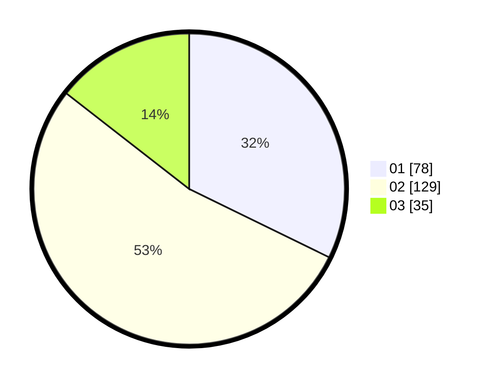

# Hasil

Hasil perolehan suara paslon dapat dilihat pada file paslon-01.txt, paslon-02.txt, dan paslon-03.txt.

Jika tidak ada, artinya data tersebut belum ada pada SIREKAP.

## Perolehan Suara

 * Paslon 01: **78**.
 * Paslon 02: **129**.
 * Paslon 03: **35**.

## Foto C Plano

https://sirekap-obj-formc.kpu.go.id/d4cc/pemilu/ppwp/31/72/03/10/02/3172031002103-20240215-134638--b78210c6-cfb1-4b61-9080-d6f5e6b5c65f.jpg

https://sirekap-obj-formc.kpu.go.id/d4cc/pemilu/ppwp/31/72/03/10/02/3172031002103-20240215-134645--48e3725d-fbae-48d3-af20-848a7b5cb503.jpg

https://sirekap-obj-formc.kpu.go.id/d4cc/pemilu/ppwp/31/72/03/10/02/3172031002103-20240215-174805--76d9564f-6ab0-411e-8776-70c85b2004de.jpg
