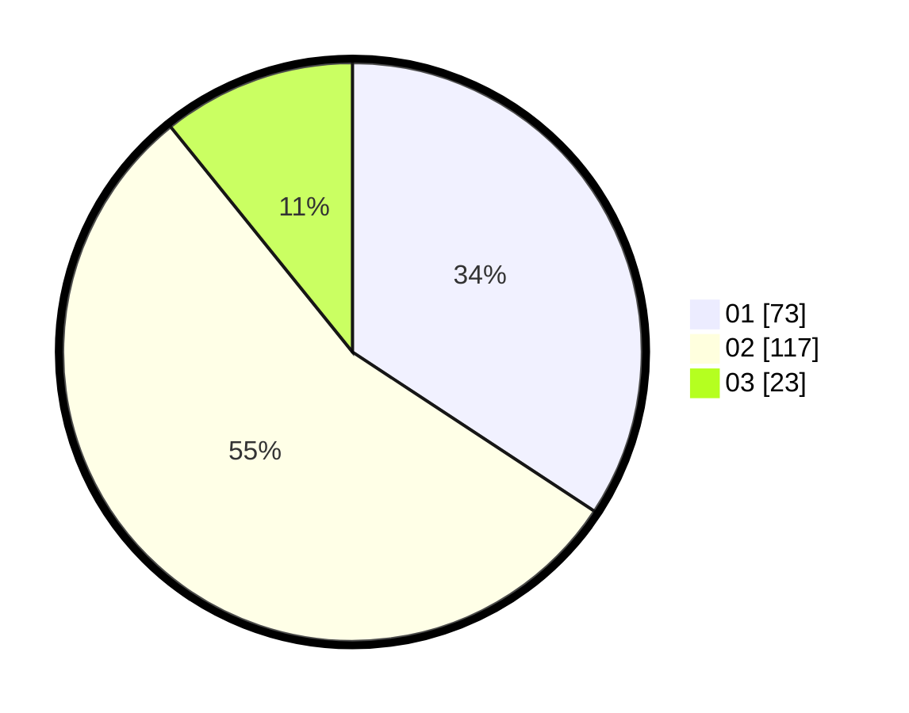

# Hasil

Hasil perolehan suara paslon dapat dilihat pada file paslon-01.txt, paslon-02.txt, dan paslon-03.txt.

Jika tidak ada, artinya data tersebut belum ada pada SIREKAP.

## Perolehan Suara

 * Paslon 01: **73**.
 * Paslon 02: **117**.
 * Paslon 03: **23**.

## Foto C Plano

https://sirekap-obj-formc.kpu.go.id/246b/pemilu/ppwp/31/72/03/10/02/3172031002114-20240214-214509--9df8a193-0d12-47bb-bf67-f3af2a725c2a.jpg

https://sirekap-obj-formc.kpu.go.id/246b/pemilu/ppwp/31/72/03/10/02/3172031002114-20240214-214641--72b9b72e-8d99-42d9-9ec9-bdfc8f8606bb.jpg

https://sirekap-obj-formc.kpu.go.id/246b/pemilu/ppwp/31/72/03/10/02/3172031002114-20240214-214748--db825ecc-0a10-4dbc-8d20-f490087bc444.jpg
