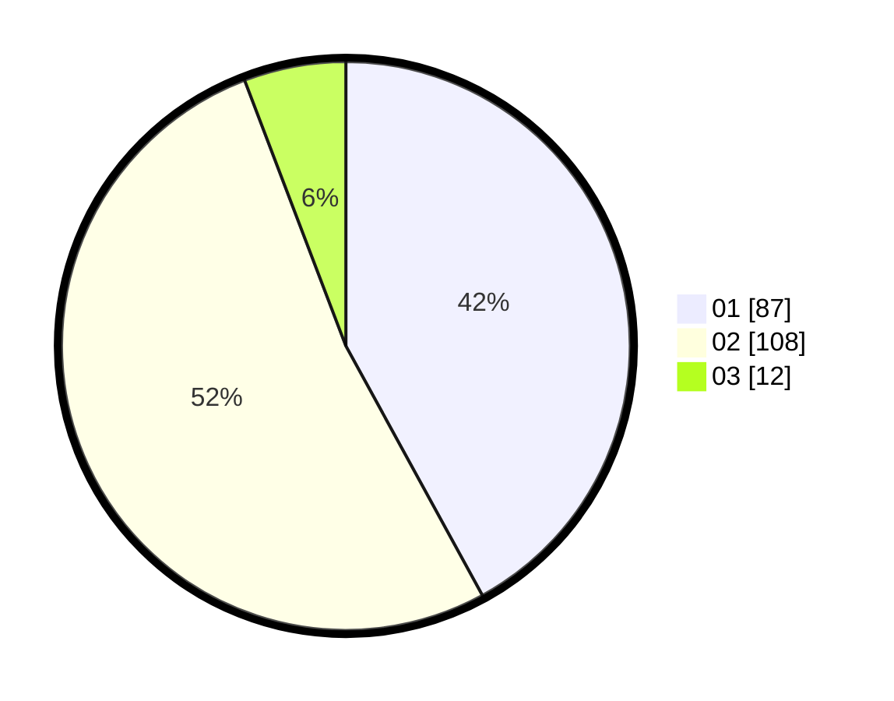

# Hasil

Hasil perolehan suara paslon dapat dilihat pada file paslon-01.txt, paslon-02.txt, dan paslon-03.txt.

Jika tidak ada, artinya data tersebut belum ada pada SIREKAP.

## Perolehan Suara

 * Paslon 01: **87**.
 * Paslon 02: **108**.
 * Paslon 03: **12**.

## Foto C Plano

https://sirekap-obj-formc.kpu.go.id/638f/pemilu/ppwp/31/72/03/10/02/3172031002116-20240215-002622--9a718538-a01b-4a6f-b39d-175fa9913928.jpg

https://sirekap-obj-formc.kpu.go.id/638f/pemilu/ppwp/31/72/03/10/02/3172031002116-20240215-002631--68c6b7a4-ae72-470b-bcfb-127311784678.jpg

https://sirekap-obj-formc.kpu.go.id/638f/pemilu/ppwp/31/72/03/10/02/3172031002116-20240215-002636--395a21ad-251c-4984-b424-05c5e8cf0156.jpg
