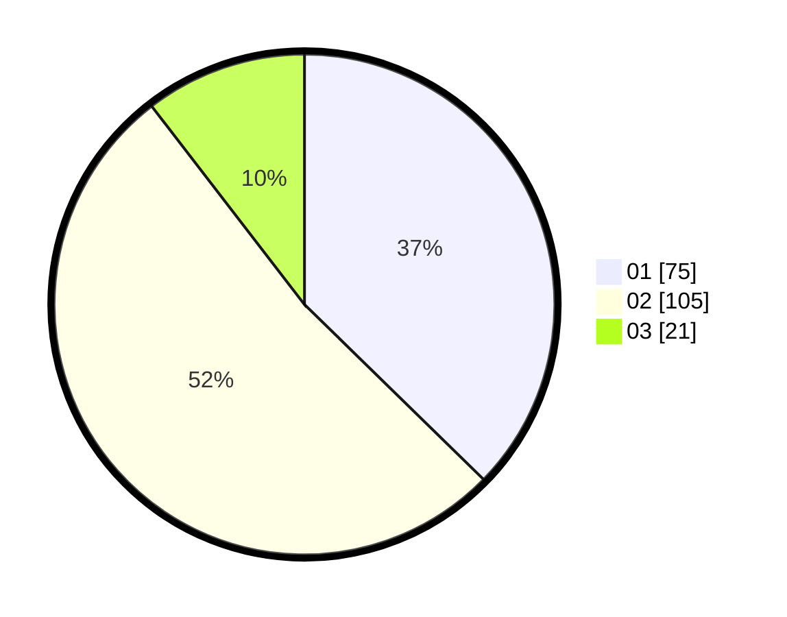

# Hasil

Hasil perolehan suara paslon dapat dilihat pada file paslon-01.txt, paslon-02.txt, dan paslon-03.txt.

Jika tidak ada, artinya data tersebut belum ada pada SIREKAP.

## Perolehan Suara

 * Paslon 01: **75**.
 * Paslon 02: **105**.
 * Paslon 03: **21**.

## Foto C Plano

https://sirekap-obj-formc.kpu.go.id/b69d/pemilu/ppwp/31/72/03/10/02/3172031002118-20240216-091546--c9fcc6f7-8987-49e1-936e-6211e71cb4dd.jpg

https://sirekap-obj-formc.kpu.go.id/b69d/pemilu/ppwp/31/72/03/10/02/3172031002118-20240216-091557--7d08641b-dcaf-4a36-9944-825ccc6a2736.jpg

https://sirekap-obj-formc.kpu.go.id/b69d/pemilu/ppwp/31/72/03/10/02/3172031002118-20240216-091641--6b018e77-fdec-473d-9e50-10e6e0eaa927.jpg

## DATA PEMILIH TETAP

Jumlah pemilih dalam DPT: **203**.
 * L: **89**.
 * P: **114**.

## DATA PENGGUNA HAK PILIH

Jumlah pengguna hak pilih dalam DPT: **201**.
 * L: **88**.
 * P: **113**.

Jumlah pengguna hak pilih dalam DPTb: **0**.
 * L: **0**.
 * P: **0**.

Jumlah pengguna hak pilih dalam DPK: **2**.
 * L: **1**.
 * P: **1**.

Jumlah pengguna hak pilih: **203**.
 * L: **89**.
 * P: **114**.

## JUMLAH SUARA SAH DAN TIDAK SAH

JUMLAH SELURUH SUARA SAH: **201**.

JUMLAH SUARA TIDAK SAH: **2**.

JUMLAH SELURUH SUARA SAH DAN SUARA TIDAK SAH: **203**.
