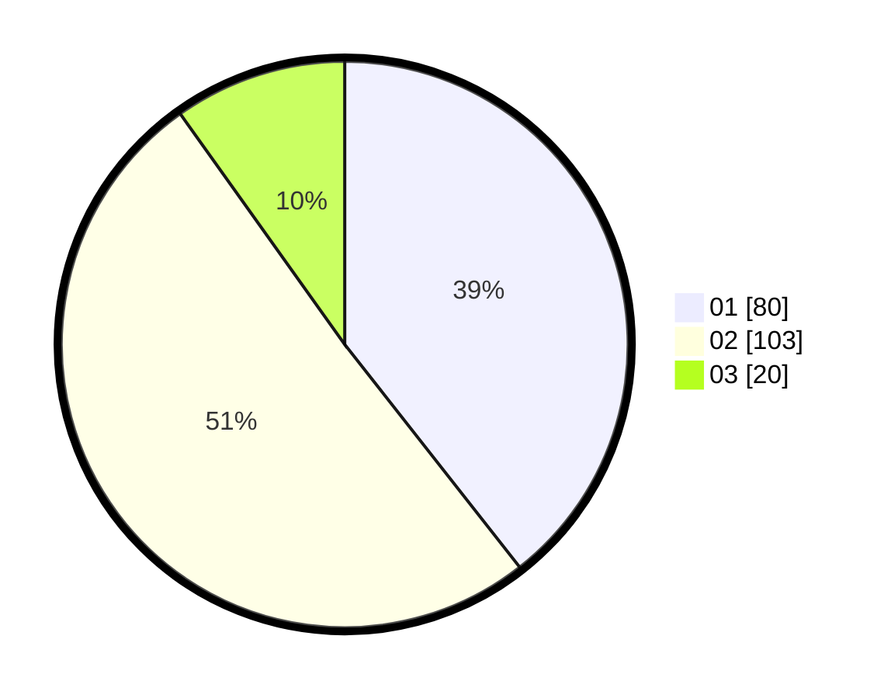

# Hasil

Hasil perolehan suara paslon dapat dilihat pada file paslon-01.txt, paslon-02.txt, dan paslon-03.txt.

Jika tidak ada, artinya data tersebut belum ada pada SIREKAP.

## Perolehan Suara

 * Paslon 01: **80**.
 * Paslon 02: **103**.
 * Paslon 03: **20**.

## Foto C Plano

https://sirekap-obj-formc.kpu.go.id/f3d6/pemilu/ppwp/31/72/03/10/02/3172031002144-20240214-184447--83c3fd37-de69-48df-850b-9cac87bccae5.jpg

https://sirekap-obj-formc.kpu.go.id/f3d6/pemilu/ppwp/31/72/03/10/02/3172031002144-20240214-184513--c8250dfa-a715-48df-b40b-565e929a3980.jpg

https://sirekap-obj-formc.kpu.go.id/f3d6/pemilu/ppwp/31/72/03/10/02/3172031002144-20240214-184317--a5522f82-996f-444e-a274-3b8a79c383d2.jpg

## DATA PEMILIH TETAP

Jumlah pemilih dalam DPT: **287**.
 * L: **142**.
 * P: **145**.

## DATA PENGGUNA HAK PILIH

Jumlah pengguna hak pilih dalam DPT: **197**.
 * L: **87**.
 * P: **110**.

Jumlah pengguna hak pilih dalam DPTb: **5**.
 * L: **2**.
 * P: **3**.

Jumlah pengguna hak pilih dalam DPK: **3**.
 * L: **1**.
 * P: **2**.

Jumlah pengguna hak pilih: **205**.
 * L: **90**.
 * P: **115**.

## JUMLAH SUARA SAH DAN TIDAK SAH

JUMLAH SELURUH SUARA SAH: **203**.

JUMLAH SUARA TIDAK SAH: **2**.

JUMLAH SELURUH SUARA SAH DAN SUARA TIDAK SAH: **205**.
