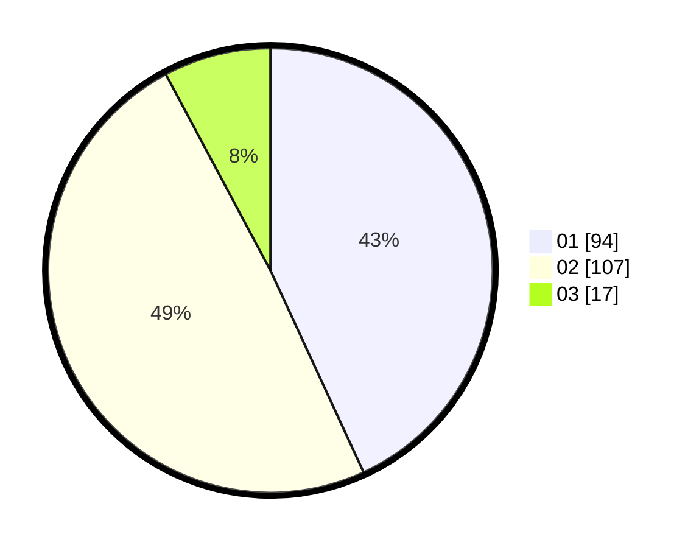

# Hasil

Hasil perolehan suara paslon dapat dilihat pada file paslon-01.txt, paslon-02.txt, dan paslon-03.txt.

Jika tidak ada, artinya data tersebut belum ada pada SIREKAP.

## Perolehan Suara

 * Paslon 01: **94**.
 * Paslon 02: **107**.
 * Paslon 03: **17**.

## Foto C Plano

https://sirekap-obj-formc.kpu.go.id/a08b/pemilu/ppwp/31/72/03/10/02/3172031002169-20240216-052509--37a6d6c4-f5d0-43a0-b47d-8503b74ba3fa.jpg

https://sirekap-obj-formc.kpu.go.id/a08b/pemilu/ppwp/31/72/03/10/02/3172031002169-20240216-052518--032e5a7f-4835-418a-8853-96cac7aa1387.jpg

https://sirekap-obj-formc.kpu.go.id/a08b/pemilu/ppwp/31/72/03/10/02/3172031002169-20240216-052526--3d7dc184-f406-47b8-8558-1545cd1d8f12.jpg

## DATA PEMILIH TETAP

Jumlah pemilih dalam DPT: **293**.
 * L: **143**.
 * P: **150**.

## DATA PENGGUNA HAK PILIH

Jumlah pengguna hak pilih dalam DPT: **219**.
 * L: **98**.
 * P: **121**.

Jumlah pengguna hak pilih dalam DPTb: **0**.
 * L: **0**.
 * P: **0**.

Jumlah pengguna hak pilih dalam DPK: **0**.
 * L: **0**.
 * P: **0**.

Jumlah pengguna hak pilih: **219**.
 * L: **98**.
 * P: **121**.

## JUMLAH SUARA SAH DAN TIDAK SAH

JUMLAH SELURUH SUARA SAH: **218**.

JUMLAH SUARA TIDAK SAH: **1**.

JUMLAH SELURUH SUARA SAH DAN SUARA TIDAK SAH: **219**.
