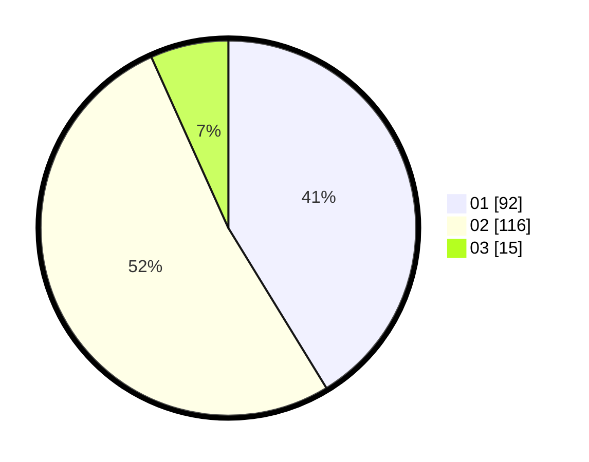

# Hasil

Hasil perolehan suara paslon dapat dilihat pada file paslon-01.txt, paslon-02.txt, dan paslon-03.txt.

Jika tidak ada, artinya data tersebut belum ada pada SIREKAP.

## Perolehan Suara

 * Paslon 01: **92**.
 * Paslon 02: **116**.
 * Paslon 03: **15**.

## Foto C Plano

https://sirekap-obj-formc.kpu.go.id/d9c9/pemilu/ppwp/31/72/03/10/02/3172031002202-20240216-230909--ba56203f-f89a-47ab-9244-103cf37a33f7.jpg

https://sirekap-obj-formc.kpu.go.id/d9c9/pemilu/ppwp/31/72/03/10/02/3172031002202-20240217-021537--e2c510ee-11e9-4340-9a46-8423a1cf88dd.jpg

https://sirekap-obj-formc.kpu.go.id/d9c9/pemilu/ppwp/31/72/03/10/02/3172031002202-20240217-021624--424dfaef-72b9-4578-b600-d414254358e1.jpg

## DATA PEMILIH TETAP

Jumlah pemilih dalam DPT: **291**.
 * L: **149**.
 * P: **142**.

## DATA PENGGUNA HAK PILIH

Jumlah pengguna hak pilih dalam DPT: **217**.
 * L: **107**.
 * P: **110**.

Jumlah pengguna hak pilih dalam DPTb: **6**.
 * L: **3**.
 * P: **3**.

Jumlah pengguna hak pilih dalam DPK: **0**.
 * L: **0**.
 * P: **0**.

Jumlah pengguna hak pilih: **223**.
 * L: **110**.
 * P: **113**.

## JUMLAH SUARA SAH DAN TIDAK SAH

JUMLAH SELURUH SUARA SAH: **223**.

JUMLAH SUARA TIDAK SAH: **0**.

JUMLAH SELURUH SUARA SAH DAN SUARA TIDAK SAH: **223**.
