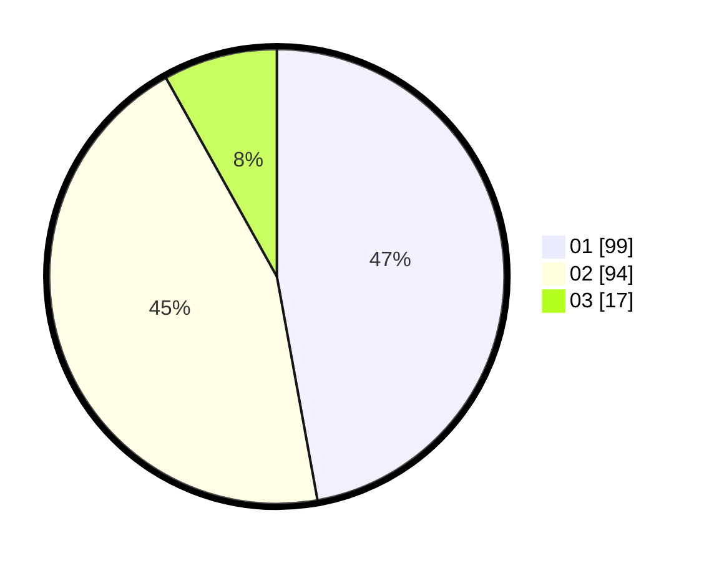

# Hasil

Hasil perolehan suara paslon dapat dilihat pada file paslon-01.txt, paslon-02.txt, dan paslon-03.txt.

Jika tidak ada, artinya data tersebut belum ada pada SIREKAP.

## Perolehan Suara

 * Paslon 01: **99**.
 * Paslon 02: **94**.
 * Paslon 03: **17**.

## Foto C Plano

https://sirekap-obj-formc.kpu.go.id/2554/pemilu/ppwp/31/72/03/10/03/3172031003002-20240216-105924--c28102e6-0941-4fe3-8bd4-57a369190362.jpg

https://sirekap-obj-formc.kpu.go.id/2554/pemilu/ppwp/31/72/03/10/03/3172031003002-20240216-105954--14402f50-9e65-48f0-bd54-6dd802e92055.jpg

https://sirekap-obj-formc.kpu.go.id/2554/pemilu/ppwp/31/72/03/10/03/3172031003002-20240216-105846--dd8a4a6a-20c2-4b27-a43b-28769dc862d7.jpg

## DATA PEMILIH TETAP

Jumlah pemilih dalam DPT: **288**.
 * L: **138**.
 * P: **150**.

## DATA PENGGUNA HAK PILIH

Jumlah pengguna hak pilih dalam DPT: **214**.
 * L: **96**.
 * P: **118**.

Jumlah pengguna hak pilih dalam DPTb: **0**.
 * L: **0**.
 * P: **0**.

Jumlah pengguna hak pilih dalam DPK: **0**.
 * L: **0**.
 * P: **0**.

Jumlah pengguna hak pilih: **214**.
 * L: **96**.
 * P: **118**.

## JUMLAH SUARA SAH DAN TIDAK SAH

JUMLAH SELURUH SUARA SAH: **210**.

JUMLAH SUARA TIDAK SAH: **4**.

JUMLAH SELURUH SUARA SAH DAN SUARA TIDAK SAH: **214**.
