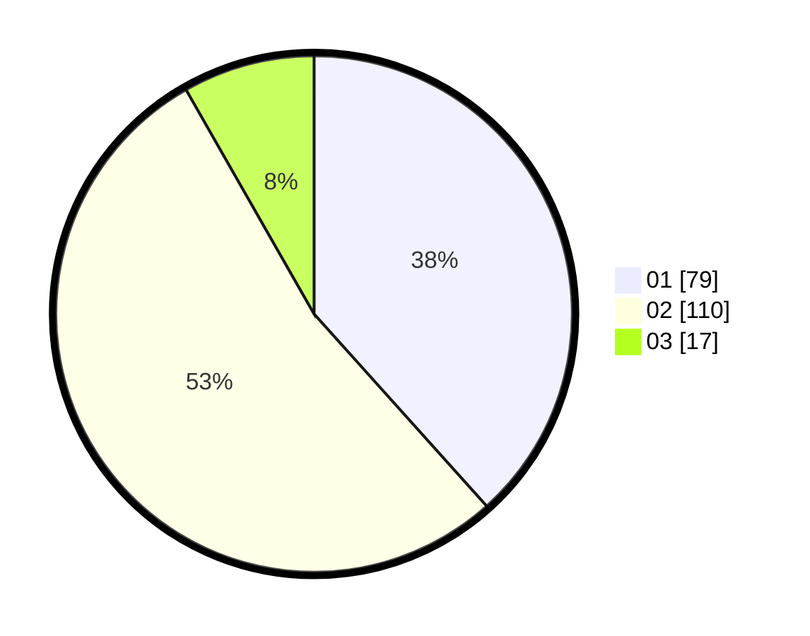

# Hasil

Hasil perolehan suara paslon dapat dilihat pada file paslon-01.txt, paslon-02.txt, dan paslon-03.txt.

Jika tidak ada, artinya data tersebut belum ada pada SIREKAP.

## Perolehan Suara

 * Paslon 01: **79**.
 * Paslon 02: **110**.
 * Paslon 03: **17**.

## Foto C Plano

https://sirekap-obj-formc.kpu.go.id/a2de/pemilu/ppwp/31/72/03/10/03/3172031003003-20240216-144501--65811c3c-b0c0-4349-861f-d4d66ed420be.jpg

https://sirekap-obj-formc.kpu.go.id/a2de/pemilu/ppwp/31/72/03/10/03/3172031003003-20240216-144503--80dff8ba-c5cd-4f77-bfa1-0a56f93f879f.jpg

https://sirekap-obj-formc.kpu.go.id/a2de/pemilu/ppwp/31/72/03/10/03/3172031003003-20240216-144502--b3a18061-ee7c-4396-a2bd-412aec75e41e.jpg

## DATA PEMILIH TETAP

Jumlah pemilih dalam DPT: **288**.
 * L: **146**.
 * P: **142**.

## DATA PENGGUNA HAK PILIH

Jumlah pengguna hak pilih dalam DPT: **203**.
 * L: **96**.
 * P: **107**.

Jumlah pengguna hak pilih dalam DPTb: **0**.
 * L: **0**.
 * P: **0**.

Jumlah pengguna hak pilih dalam DPK: **5**.
 * L: **4**.
 * P: **1**.

Jumlah pengguna hak pilih: **208**.
 * L: **100**.
 * P: **108**.

## JUMLAH SUARA SAH DAN TIDAK SAH

JUMLAH SELURUH SUARA SAH: **206**.

JUMLAH SUARA TIDAK SAH: **2**.

JUMLAH SELURUH SUARA SAH DAN SUARA TIDAK SAH: **208**.
