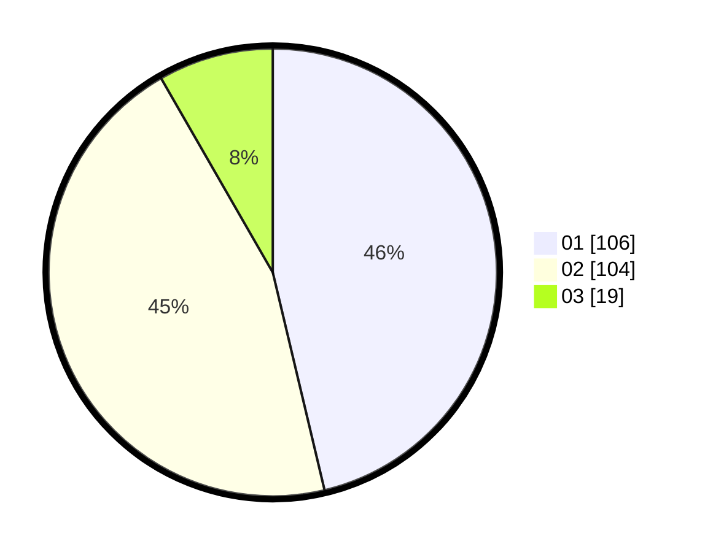

# Hasil

Hasil perolehan suara paslon dapat dilihat pada file paslon-01.txt, paslon-02.txt, dan paslon-03.txt.

Jika tidak ada, artinya data tersebut belum ada pada SIREKAP.

## Perolehan Suara

 * Paslon 01: **106**.
 * Paslon 02: **104**.
 * Paslon 03: **19**.

## Foto C Plano

https://sirekap-obj-formc.kpu.go.id/0eb7/pemilu/ppwp/31/72/03/10/03/3172031003010-20240214-221202--c723efd6-b0c1-423e-9906-e6c01248c159.jpg

https://sirekap-obj-formc.kpu.go.id/0eb7/pemilu/ppwp/31/72/03/10/03/3172031003010-20240214-221016--cbba15d5-8342-4714-bbb5-b5b08bf2644f.jpg

https://sirekap-obj-formc.kpu.go.id/0eb7/pemilu/ppwp/31/72/03/10/03/3172031003010-20240214-221314--06930f14-4810-401c-a1bb-d8118698586b.jpg
