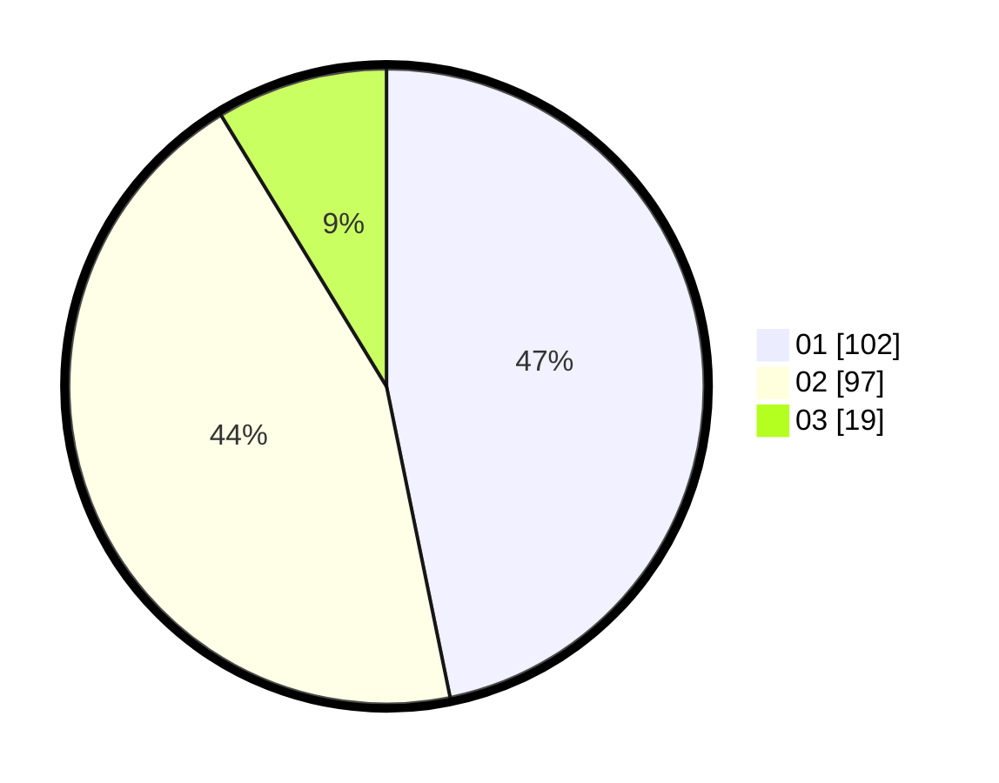

# Hasil

Hasil perolehan suara paslon dapat dilihat pada file paslon-01.txt, paslon-02.txt, dan paslon-03.txt.

Jika tidak ada, artinya data tersebut belum ada pada SIREKAP.

## Perolehan Suara

 * Paslon 01: **102**.
 * Paslon 02: **97**.
 * Paslon 03: **19**.

## Foto C Plano

https://sirekap-obj-formc.kpu.go.id/ed3b/pemilu/ppwp/31/72/03/10/03/3172031003014-20240215-025500--a74bb67e-808c-4f8f-a6c0-7789c78dc3c1.jpg

https://sirekap-obj-formc.kpu.go.id/ed3b/pemilu/ppwp/31/72/03/10/03/3172031003014-20240215-025545--2f4e855b-bf9d-4463-9a22-3051e704d194.jpg

https://sirekap-obj-formc.kpu.go.id/ed3b/pemilu/ppwp/31/72/03/10/03/3172031003014-20240215-025620--0c198483-663d-4d12-b7d0-97160ba4a098.jpg
