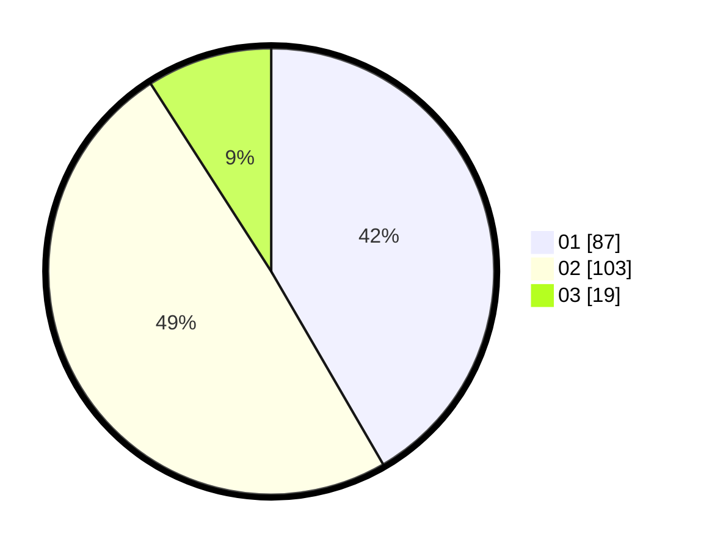

# Hasil

Hasil perolehan suara paslon dapat dilihat pada file paslon-01.txt, paslon-02.txt, dan paslon-03.txt.

Jika tidak ada, artinya data tersebut belum ada pada SIREKAP.

## Perolehan Suara

 * Paslon 01: **87**.
 * Paslon 02: **103**.
 * Paslon 03: **19**.

## Foto C Plano

https://sirekap-obj-formc.kpu.go.id/fddf/pemilu/ppwp/31/72/03/10/03/3172031003022-20240216-112230--bd4e7918-e46e-4adc-806a-43e3488078ff.jpg

https://sirekap-obj-formc.kpu.go.id/fddf/pemilu/ppwp/31/72/03/10/03/3172031003022-20240216-112434--334774a3-ba67-49bf-adba-b5f4fd8b5464.jpg

https://sirekap-obj-formc.kpu.go.id/fddf/pemilu/ppwp/31/72/03/10/03/3172031003022-20240216-112546--df494c72-36aa-4a1b-99a7-28c8d6cb5149.jpg

## DATA PEMILIH TETAP

Jumlah pemilih dalam DPT: **283**.
 * L: **141**.
 * P: **142**.

## DATA PENGGUNA HAK PILIH

Jumlah pengguna hak pilih dalam DPT: **212**.
 * L: **98**.
 * P: **114**.

Jumlah pengguna hak pilih dalam DPTb: **0**.
 * L: **0**.
 * P: **0**.

Jumlah pengguna hak pilih dalam DPK: **1**.
 * L: **0**.
 * P: **1**.

Jumlah pengguna hak pilih: **213**.
 * L: **98**.
 * P: **115**.

## JUMLAH SUARA SAH DAN TIDAK SAH

JUMLAH SELURUH SUARA SAH: **209**.

JUMLAH SUARA TIDAK SAH: **4**.

JUMLAH SELURUH SUARA SAH DAN SUARA TIDAK SAH: **213**.
