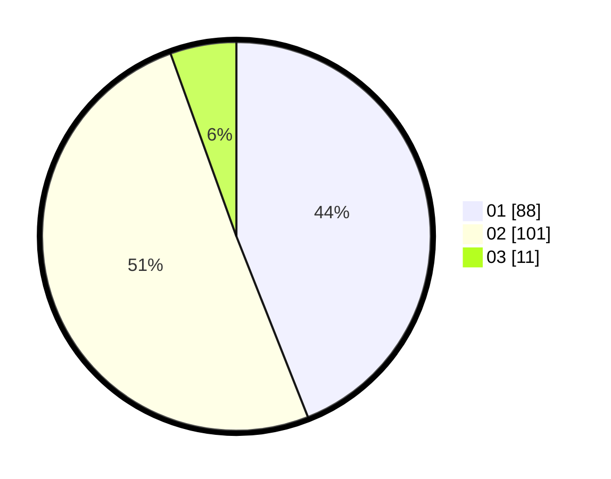

# Hasil

Hasil perolehan suara paslon dapat dilihat pada file paslon-01.txt, paslon-02.txt, dan paslon-03.txt.

Jika tidak ada, artinya data tersebut belum ada pada SIREKAP.

## Perolehan Suara

 * Paslon 01: **88**.
 * Paslon 02: **101**.
 * Paslon 03: **11**.

## Foto C Plano

https://sirekap-obj-formc.kpu.go.id/e6cc/pemilu/ppwp/31/72/03/10/03/3172031003023-20240216-113301--646643f7-c09b-4281-bb03-ef731c3c1741.jpg

https://sirekap-obj-formc.kpu.go.id/e6cc/pemilu/ppwp/31/72/03/10/03/3172031003023-20240216-113406--d22d823b-a4d9-435b-9dc0-9babfd9064a8.jpg

https://sirekap-obj-formc.kpu.go.id/e6cc/pemilu/ppwp/31/72/03/10/03/3172031003023-20240216-114013--f3ee51c4-235e-45dd-be15-8badf8e8fa71.jpg

## DATA PEMILIH TETAP

Jumlah pemilih dalam DPT: **292**.
 * L: **159**.
 * P: **133**.

## DATA PENGGUNA HAK PILIH

Jumlah pengguna hak pilih dalam DPT: **205**.
 * L: **104**.
 * P: **101**.

Jumlah pengguna hak pilih dalam DPTb: **0**.
 * L: **0**.
 * P: **0**.

Jumlah pengguna hak pilih dalam DPK: **0**.
 * L: **0**.
 * P: **0**.

Jumlah pengguna hak pilih: **205**.
 * L: **104**.
 * P: **101**.

## JUMLAH SUARA SAH DAN TIDAK SAH

JUMLAH SELURUH SUARA SAH: **200**.

JUMLAH SUARA TIDAK SAH: **5**.

JUMLAH SELURUH SUARA SAH DAN SUARA TIDAK SAH: **205**.
