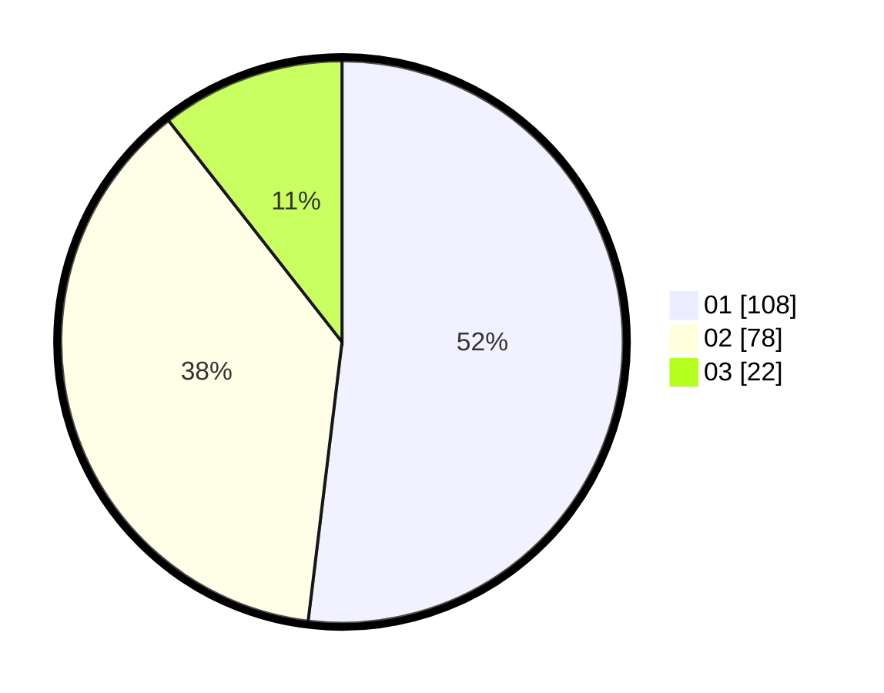

# Hasil

Hasil perolehan suara paslon dapat dilihat pada file paslon-01.txt, paslon-02.txt, dan paslon-03.txt.

Jika tidak ada, artinya data tersebut belum ada pada SIREKAP.

## Perolehan Suara

 * Paslon 01: **108**.
 * Paslon 02: **78**.
 * Paslon 03: **22**.

## Foto C Plano

https://sirekap-obj-formc.kpu.go.id/6cfb/pemilu/ppwp/31/72/03/10/03/3172031003051-20240215-002343--1af842bb-b354-4032-b8ec-92d20e63376e.jpg

https://sirekap-obj-formc.kpu.go.id/6cfb/pemilu/ppwp/31/72/03/10/03/3172031003051-20240215-002536--1466abc3-369e-4489-961a-7dff3cada20e.jpg

https://sirekap-obj-formc.kpu.go.id/6cfb/pemilu/ppwp/31/72/03/10/03/3172031003051-20240215-002607--bccee148-f43b-4460-a1a2-05770c372dd4.jpg
