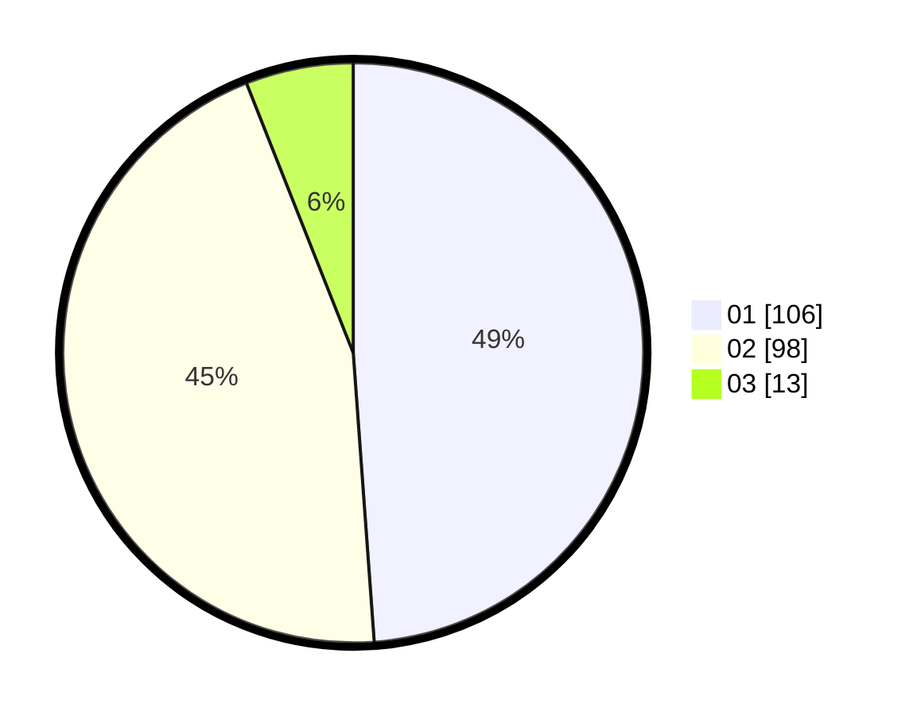

# Hasil

Hasil perolehan suara paslon dapat dilihat pada file paslon-01.txt, paslon-02.txt, dan paslon-03.txt.

Jika tidak ada, artinya data tersebut belum ada pada SIREKAP.

## Perolehan Suara

 * Paslon 01: **106**.
 * Paslon 02: **98**.
 * Paslon 03: **13**.

## Foto C Plano

https://sirekap-obj-formc.kpu.go.id/60cc/pemilu/ppwp/31/72/03/10/03/3172031003052-20240215-212011--0717a3ee-74a1-45cc-862c-be5b7b0e0bc3.jpg

https://sirekap-obj-formc.kpu.go.id/60cc/pemilu/ppwp/31/72/03/10/03/3172031003052-20240214-195850--c6ff8667-b700-4d97-85fa-2913e4a0448a.jpg

https://sirekap-obj-formc.kpu.go.id/60cc/pemilu/ppwp/31/72/03/10/03/3172031003052-20240214-195901--bc82c2d6-45a9-49b5-9f80-094e76cd9ac8.jpg

## DATA PEMILIH TETAP

Jumlah pemilih dalam DPT: **290**.
 * L: **149**.
 * P: **141**.

## DATA PENGGUNA HAK PILIH

Jumlah pengguna hak pilih dalam DPT: **218**.
 * L: **107**.
 * P: **111**.

Jumlah pengguna hak pilih dalam DPTb: **1**.
 * L: **1**.
 * P: **0**.

Jumlah pengguna hak pilih dalam DPK: **2**.
 * L: **1**.
 * P: **1**.

Jumlah pengguna hak pilih: **221**.
 * L: **109**.
 * P: **112**.

## JUMLAH SUARA SAH DAN TIDAK SAH

JUMLAH SELURUH SUARA SAH: **217**.

JUMLAH SUARA TIDAK SAH: **4**.

JUMLAH SELURUH SUARA SAH DAN SUARA TIDAK SAH: **221**.
