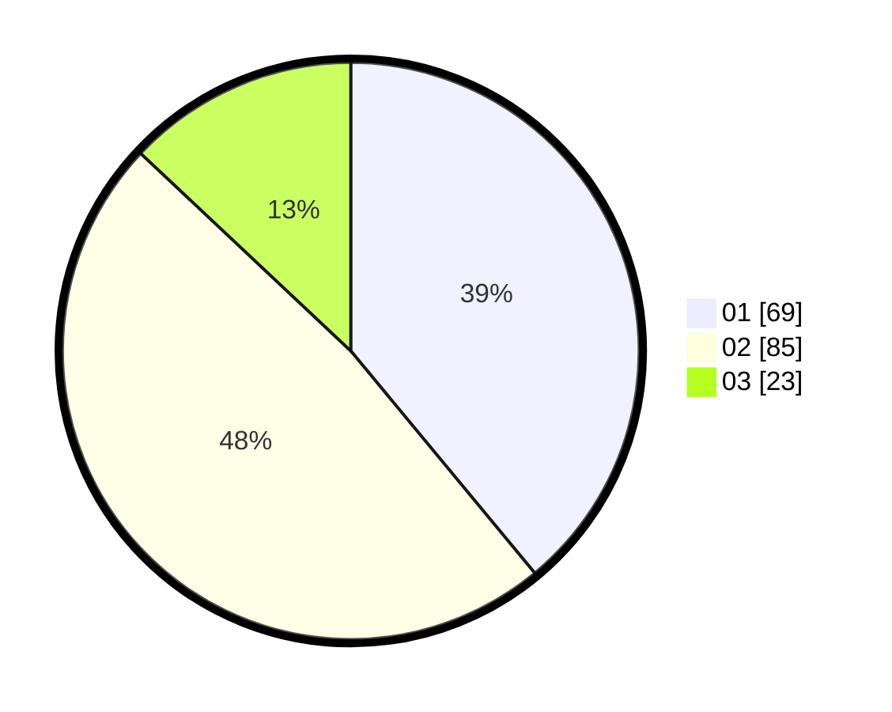

# Hasil

Hasil perolehan suara paslon dapat dilihat pada file paslon-01.txt, paslon-02.txt, dan paslon-03.txt.

Jika tidak ada, artinya data tersebut belum ada pada SIREKAP.

## Perolehan Suara

 * Paslon 01: **69**.
 * Paslon 02: **85**.
 * Paslon 03: **23**.

## Foto C Plano

https://sirekap-obj-formc.kpu.go.id/4b47/pemilu/ppwp/31/72/03/10/03/3172031003054-20240214-160056--7eb10600-73d9-42de-a4dd-6b35e7343cfb.jpg

https://sirekap-obj-formc.kpu.go.id/4b47/pemilu/ppwp/31/72/03/10/03/3172031003054-20240214-155136--5989841d-0625-4abd-bceb-5b82f2775df6.jpg

https://sirekap-obj-formc.kpu.go.id/4b47/pemilu/ppwp/31/72/03/10/03/3172031003054-20240214-201058--98d66a1f-d245-49fe-9b43-05b8696f69bc.jpg

## DATA PEMILIH TETAP

Jumlah pemilih dalam DPT: **285**.
 * L: **145**.
 * P: **140**.

## DATA PENGGUNA HAK PILIH

Jumlah pengguna hak pilih dalam DPT: **285**.
 * L: **145**.
 * P: **140**.

Jumlah pengguna hak pilih dalam DPTb: **0**.
 * L: **0**.
 * P: **0**.

Jumlah pengguna hak pilih dalam DPK: **0**.
 * L: **0**.
 * P: **0**.

Jumlah pengguna hak pilih: **285**.
 * L: **145**.
 * P: **140**.

## JUMLAH SUARA SAH DAN TIDAK SAH

JUMLAH SELURUH SUARA SAH: **178**.

JUMLAH SUARA TIDAK SAH: **4**.

JUMLAH SELURUH SUARA SAH DAN SUARA TIDAK SAH: **182**.
