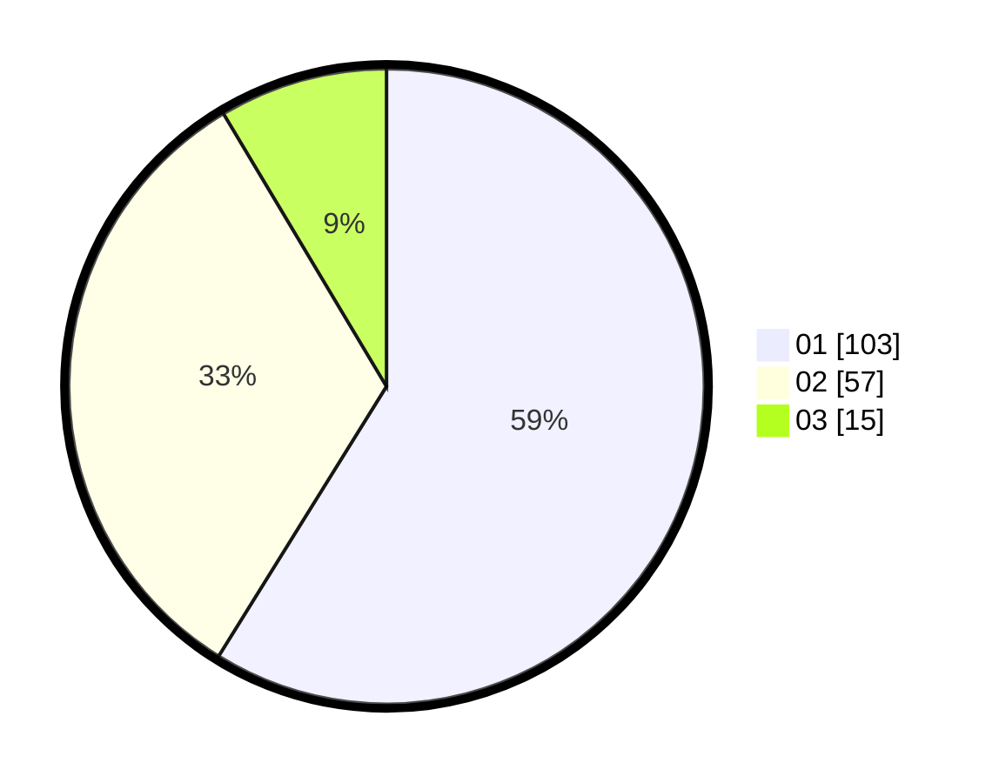

# Hasil

Hasil perolehan suara paslon dapat dilihat pada file paslon-01.txt, paslon-02.txt, dan paslon-03.txt.

Jika tidak ada, artinya data tersebut belum ada pada SIREKAP.

## Perolehan Suara

 * Paslon 01: **103**.
 * Paslon 02: **57**.
 * Paslon 03: **15**.

## Foto C Plano

https://sirekap-obj-formc.kpu.go.id/2db5/pemilu/ppwp/31/72/03/10/03/3172031003057-20240214-195255--e0cb9608-8f61-4ec2-a06e-c3f5f7c26b04.jpg

https://sirekap-obj-formc.kpu.go.id/2db5/pemilu/ppwp/31/72/03/10/03/3172031003057-20240214-193414--782186ae-a235-46f4-8a31-f60706b4a012.jpg

https://sirekap-obj-formc.kpu.go.id/2db5/pemilu/ppwp/31/72/03/10/03/3172031003057-20240214-195445--b630d601-863d-4f9b-8fe3-d115ce8e59bb.jpg
