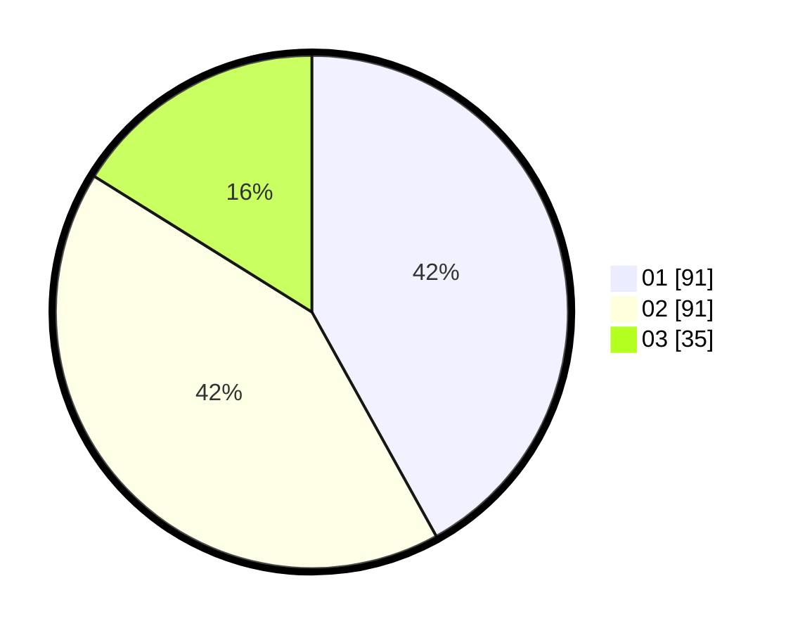

# Hasil

Hasil perolehan suara paslon dapat dilihat pada file paslon-01.txt, paslon-02.txt, dan paslon-03.txt.

Jika tidak ada, artinya data tersebut belum ada pada SIREKAP.

## Perolehan Suara

 * Paslon 01: **91**.
 * Paslon 02: **91**.
 * Paslon 03: **35**.

## Foto C Plano

https://sirekap-obj-formc.kpu.go.id/4a4d/pemilu/ppwp/31/72/03/10/03/3172031003061-20240214-155028--e8ea9269-8e7e-4d54-a326-69114bdd07fb.jpg

https://sirekap-obj-formc.kpu.go.id/4a4d/pemilu/ppwp/31/72/03/10/03/3172031003061-20240214-155205--d8b65664-f296-4492-a1e2-ed91776131c6.jpg

https://sirekap-obj-formc.kpu.go.id/4a4d/pemilu/ppwp/31/72/03/10/03/3172031003061-20240214-155638--a4d4d219-ec67-41fa-a403-24e6902edec1.jpg

## DATA PEMILIH TETAP

Jumlah pemilih dalam DPT: **288**.
 * L: **144**.
 * P: **144**.

## DATA PENGGUNA HAK PILIH

Jumlah pengguna hak pilih dalam DPT: **220**.
 * L: **104**.
 * P: **116**.

Jumlah pengguna hak pilih dalam DPTb: **0**.
 * L: **0**.
 * P: **0**.

Jumlah pengguna hak pilih dalam DPK: **0**.
 * L: **0**.
 * P: **0**.

Jumlah pengguna hak pilih: **220**.
 * L: **104**.
 * P: **116**.

## JUMLAH SUARA SAH DAN TIDAK SAH

JUMLAH SELURUH SUARA SAH: **217**.

JUMLAH SUARA TIDAK SAH: **3**.

JUMLAH SELURUH SUARA SAH DAN SUARA TIDAK SAH: **220**.
