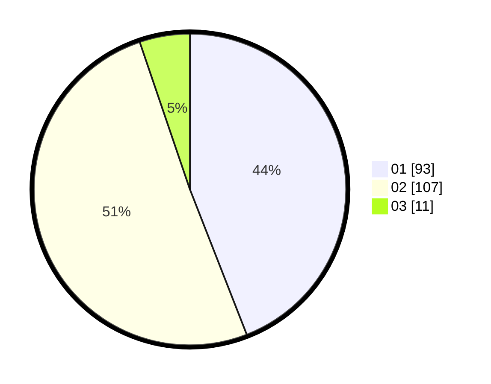

# Hasil

Hasil perolehan suara paslon dapat dilihat pada file paslon-01.txt, paslon-02.txt, dan paslon-03.txt.

Jika tidak ada, artinya data tersebut belum ada pada SIREKAP.

## Perolehan Suara

 * Paslon 01: **93**.
 * Paslon 02: **107**.
 * Paslon 03: **11**.

## Foto C Plano

https://sirekap-obj-formc.kpu.go.id/71f2/pemilu/ppwp/31/72/03/10/03/3172031003084-20240215-224313--a82de897-2225-4997-8c32-2c2cced8b481.jpg

https://sirekap-obj-formc.kpu.go.id/71f2/pemilu/ppwp/31/72/03/10/03/3172031003084-20240215-222906--7519b3aa-77a0-4c08-b71d-0dd9dacced51.jpg

https://sirekap-obj-formc.kpu.go.id/71f2/pemilu/ppwp/31/72/03/10/03/3172031003084-20240214-230842--672a2b7d-f724-4462-930a-ff250314b300.jpg

## DATA PEMILIH TETAP

Jumlah pemilih dalam DPT: **256**.
 * L: **124**.
 * P: **132**.

## DATA PENGGUNA HAK PILIH

Jumlah pengguna hak pilih dalam DPT: **213**.
 * L: **109**.
 * P: **104**.

Jumlah pengguna hak pilih dalam DPTb: **0**.
 * L: **0**.
 * P: **0**.

Jumlah pengguna hak pilih dalam DPK: **0**.
 * L: **0**.
 * P: **0**.

Jumlah pengguna hak pilih: **213**.
 * L: **109**.
 * P: **104**.

## JUMLAH SUARA SAH DAN TIDAK SAH

JUMLAH SELURUH SUARA SAH: **211**.

JUMLAH SUARA TIDAK SAH: **2**.

JUMLAH SELURUH SUARA SAH DAN SUARA TIDAK SAH: **213**.
