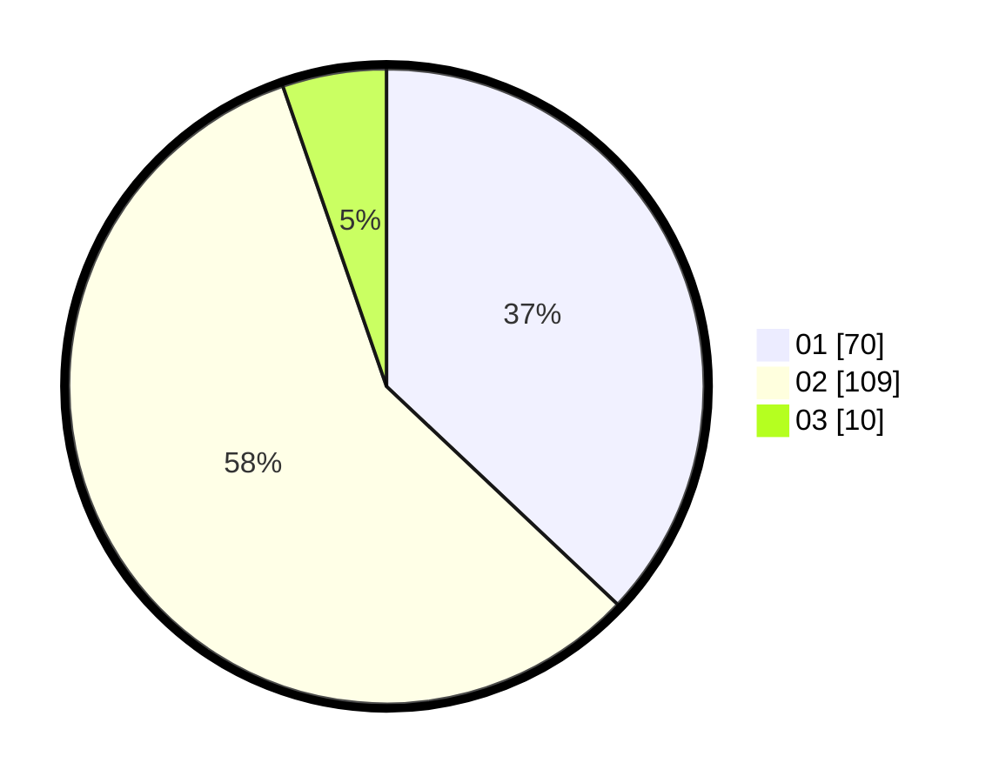

# Hasil

Hasil perolehan suara paslon dapat dilihat pada file paslon-01.txt, paslon-02.txt, dan paslon-03.txt.

Jika tidak ada, artinya data tersebut belum ada pada SIREKAP.

## Perolehan Suara

 * Paslon 01: **70**.
 * Paslon 02: **109**.
 * Paslon 03: **10**.

## Foto C Plano

https://sirekap-obj-formc.kpu.go.id/035f/pemilu/ppwp/31/72/03/10/03/3172031003100-20240214-224711--9f1f0c5c-3118-4c93-9833-463fcf810cd7.jpg

https://sirekap-obj-formc.kpu.go.id/035f/pemilu/ppwp/31/72/03/10/03/3172031003100-20240214-224824--f5014e95-d3cd-4c58-9788-1a2eec41965d.jpg

https://sirekap-obj-formc.kpu.go.id/035f/pemilu/ppwp/31/72/03/10/03/3172031003100-20240214-193734--ad5a35d3-5f9e-4a0e-8183-0c079d927be9.jpg

## DATA PEMILIH TETAP

Jumlah pemilih dalam DPT: **280**.
 * L: **134**.
 * P: **146**.

## DATA PENGGUNA HAK PILIH

Jumlah pengguna hak pilih dalam DPT: **196**.
 * L: **88**.
 * P: **108**.

Jumlah pengguna hak pilih dalam DPTb: **0**.
 * L: **0**.
 * P: **0**.

Jumlah pengguna hak pilih dalam DPK: **0**.
 * L: **0**.
 * P: **0**.

Jumlah pengguna hak pilih: **196**.
 * L: **88**.
 * P: **108**.

## JUMLAH SUARA SAH DAN TIDAK SAH

JUMLAH SELURUH SUARA SAH: **189**.

JUMLAH SUARA TIDAK SAH: **7**.

JUMLAH SELURUH SUARA SAH DAN SUARA TIDAK SAH: **196**.
