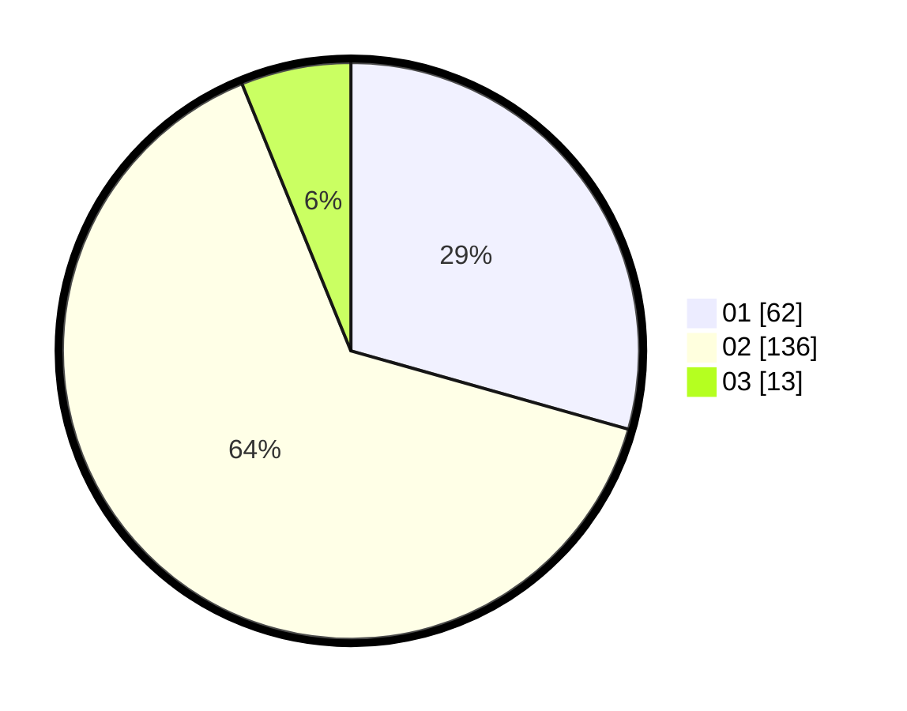

# Hasil

Hasil perolehan suara paslon dapat dilihat pada file paslon-01.txt, paslon-02.txt, dan paslon-03.txt.

Jika tidak ada, artinya data tersebut belum ada pada SIREKAP.

## Perolehan Suara

 * Paslon 01: **62**.
 * Paslon 02: **136**.
 * Paslon 03: **13**.

## Foto C Plano

https://sirekap-obj-formc.kpu.go.id/ba15/pemilu/ppwp/31/72/03/10/03/3172031003141-20240214-230656--4e60f1ba-0f47-4f4c-a3d5-a6a8df9b21ae.jpg

https://sirekap-obj-formc.kpu.go.id/ba15/pemilu/ppwp/31/72/03/10/03/3172031003141-20240214-230736--ca5e5e5d-a1d4-4217-8b87-ba416afe28ce.jpg

https://sirekap-obj-formc.kpu.go.id/ba15/pemilu/ppwp/31/72/03/10/03/3172031003141-20240214-230810--4d846f94-ae1c-4263-9955-dfa65514c389.jpg

## DATA PEMILIH TETAP

Jumlah pemilih dalam DPT: **295**.
 * L: **145**.
 * P: **150**.

## DATA PENGGUNA HAK PILIH

Jumlah pengguna hak pilih dalam DPT: **213**.
 * L: **99**.
 * P: **114**.

Jumlah pengguna hak pilih dalam DPTb: **2**.
 * L: **1**.
 * P: **1**.

Jumlah pengguna hak pilih dalam DPK: **1**.
 * L: **1**.
 * P: **0**.

Jumlah pengguna hak pilih: **216**.
 * L: **101**.
 * P: **115**.

## JUMLAH SUARA SAH DAN TIDAK SAH

JUMLAH SELURUH SUARA SAH: **211**.

JUMLAH SUARA TIDAK SAH: **5**.

JUMLAH SELURUH SUARA SAH DAN SUARA TIDAK SAH: **216**.
