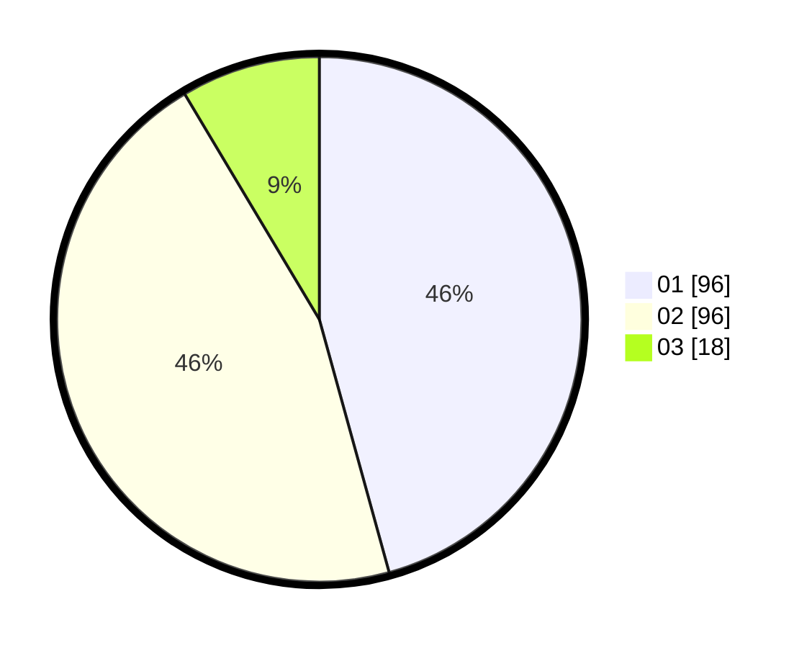

# Hasil

Hasil perolehan suara paslon dapat dilihat pada file paslon-01.txt, paslon-02.txt, dan paslon-03.txt.

Jika tidak ada, artinya data tersebut belum ada pada SIREKAP.

## Perolehan Suara

 * Paslon 01: **96**.
 * Paslon 02: **96**.
 * Paslon 03: **18**.

## Foto C Plano

https://sirekap-obj-formc.kpu.go.id/b8f7/pemilu/ppwp/31/72/03/10/03/3172031003149-20240214-210424--6d879891-d39a-44db-a242-831d8e0afc3e.jpg

https://sirekap-obj-formc.kpu.go.id/b8f7/pemilu/ppwp/31/72/03/10/03/3172031003149-20240214-210653--999fb80f-a0ef-4d4b-bf34-dd00537170b2.jpg

https://sirekap-obj-formc.kpu.go.id/b8f7/pemilu/ppwp/31/72/03/10/03/3172031003149-20240214-210759--4e7f5238-0c7d-4de6-a205-0e9e11e0af55.jpg

## DATA PEMILIH TETAP

Jumlah pemilih dalam DPT: **294**.
 * L: **144**.
 * P: **150**.

## DATA PENGGUNA HAK PILIH

Jumlah pengguna hak pilih dalam DPT: **211**.
 * L: **93**.
 * P: **118**.

Jumlah pengguna hak pilih dalam DPTb: **0**.
 * L: **0**.
 * P: **0**.

Jumlah pengguna hak pilih dalam DPK: **4**.
 * L: **2**.
 * P: **2**.

Jumlah pengguna hak pilih: **215**.
 * L: **95**.
 * P: **120**.

## JUMLAH SUARA SAH DAN TIDAK SAH

JUMLAH SELURUH SUARA SAH: **210**.

JUMLAH SUARA TIDAK SAH: **5**.

JUMLAH SELURUH SUARA SAH DAN SUARA TIDAK SAH: **215**.
