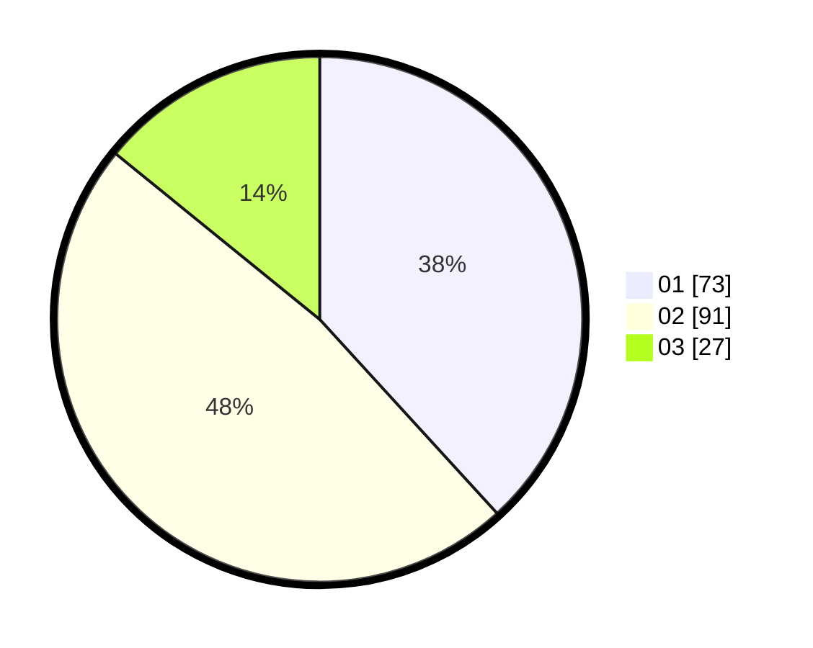

# Hasil

Hasil perolehan suara paslon dapat dilihat pada file paslon-01.txt, paslon-02.txt, dan paslon-03.txt.

Jika tidak ada, artinya data tersebut belum ada pada SIREKAP.

## Perolehan Suara

 * Paslon 01: **73**.
 * Paslon 02: **91**.
 * Paslon 03: **27**.

## Foto C Plano

https://sirekap-obj-formc.kpu.go.id/e24a/pemilu/ppwp/31/72/03/10/03/3172031003161-20240215-024217--54b5222a-c4d4-4e63-991d-bb571b3df24a.jpg

https://sirekap-obj-formc.kpu.go.id/e24a/pemilu/ppwp/31/72/03/10/03/3172031003161-20240214-232407--8efa3e93-8933-469f-8307-4fb8c88478ba.jpg

https://sirekap-obj-formc.kpu.go.id/e24a/pemilu/ppwp/31/72/03/10/03/3172031003161-20240215-024313--5209f222-25de-481e-b103-9b65354655a1.jpg

## DATA PEMILIH TETAP

Jumlah pemilih dalam DPT: **272**.
 * L: **135**.
 * P: **137**.

## DATA PENGGUNA HAK PILIH

Jumlah pengguna hak pilih dalam DPT: **186**.
 * L: **82**.
 * P: **104**.

Jumlah pengguna hak pilih dalam DPTb: **6**.
 * L: **2**.
 * P: **4**.

Jumlah pengguna hak pilih dalam DPK: **0**.
 * L: **0**.
 * P: **0**.

Jumlah pengguna hak pilih: **192**.
 * L: **84**.
 * P: **108**.

## JUMLAH SUARA SAH DAN TIDAK SAH

JUMLAH SELURUH SUARA SAH: **191**.

JUMLAH SUARA TIDAK SAH: **3**.

JUMLAH SELURUH SUARA SAH DAN SUARA TIDAK SAH: **194**.
