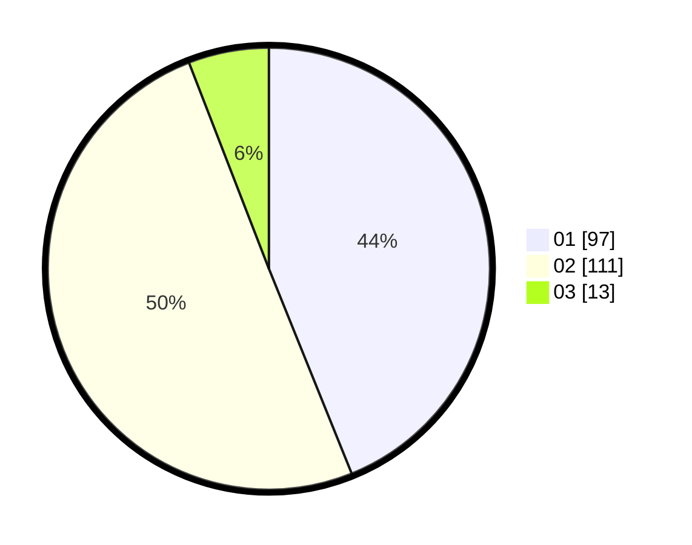

# Hasil

Hasil perolehan suara paslon dapat dilihat pada file paslon-01.txt, paslon-02.txt, dan paslon-03.txt.

Jika tidak ada, artinya data tersebut belum ada pada SIREKAP.

## Perolehan Suara

 * Paslon 01: **97**.
 * Paslon 02: **111**.
 * Paslon 03: **13**.

## Foto C Plano

https://sirekap-obj-formc.kpu.go.id/3805/pemilu/ppwp/31/72/03/10/03/3172031003162-20240216-150545--5109a73f-b47a-4205-b770-7856ee3d002b.jpg

https://sirekap-obj-formc.kpu.go.id/3805/pemilu/ppwp/31/72/03/10/03/3172031003162-20240216-150546--f14f175b-0979-4bbc-a4b5-65f426256898.jpg

https://sirekap-obj-formc.kpu.go.id/3805/pemilu/ppwp/31/72/03/10/03/3172031003162-20240216-150546--e4e61934-99f5-4db6-95ab-1b9e73590e54.jpg

## DATA PEMILIH TETAP

Jumlah pemilih dalam DPT: **271**.
 * L: **132**.
 * P: **139**.

## DATA PENGGUNA HAK PILIH

Jumlah pengguna hak pilih dalam DPT: **217**.
 * L: **100**.
 * P: **117**.

Jumlah pengguna hak pilih dalam DPTb: **0**.
 * L: **0**.
 * P: **0**.

Jumlah pengguna hak pilih dalam DPK: **7**.
 * L: **4**.
 * P: **3**.

Jumlah pengguna hak pilih: **224**.
 * L: **104**.
 * P: **120**.

## JUMLAH SUARA SAH DAN TIDAK SAH

JUMLAH SELURUH SUARA SAH: **221**.

JUMLAH SUARA TIDAK SAH: **3**.

JUMLAH SELURUH SUARA SAH DAN SUARA TIDAK SAH: **224**.
