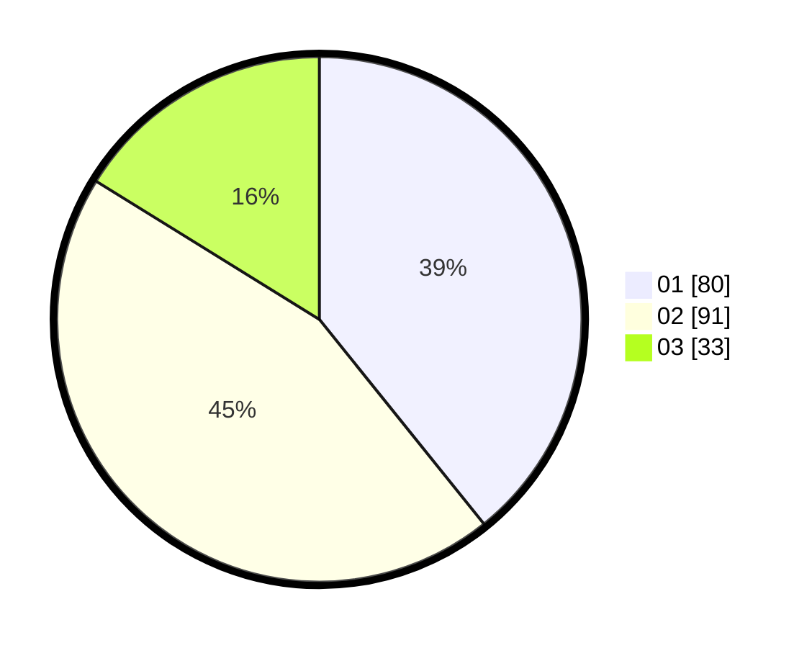

# Hasil

Hasil perolehan suara paslon dapat dilihat pada file paslon-01.txt, paslon-02.txt, dan paslon-03.txt.

Jika tidak ada, artinya data tersebut belum ada pada SIREKAP.

## Perolehan Suara

 * Paslon 01: **80**.
 * Paslon 02: **91**.
 * Paslon 03: **33**.

## Foto C Plano

https://sirekap-obj-formc.kpu.go.id/46a6/pemilu/ppwp/31/72/03/10/03/3172031003165-20240214-191346--09cfc844-4df5-49c0-871c-dbda79037a30.jpg

https://sirekap-obj-formc.kpu.go.id/46a6/pemilu/ppwp/31/72/03/10/03/3172031003165-20240214-191017--4b2664f7-d7a5-474e-b009-e54fc7dc75aa.jpg

https://sirekap-obj-formc.kpu.go.id/46a6/pemilu/ppwp/31/72/03/10/03/3172031003165-20240214-191111--65179235-e8ab-4b0a-9a4e-b43c2d49eaf8.jpg

## DATA PEMILIH TETAP

Jumlah pemilih dalam DPT: **201**.
 * L: **81**.
 * P: **120**.

## DATA PENGGUNA HAK PILIH

Jumlah pengguna hak pilih dalam DPT: **201**.
 * L: **81**.
 * P: **120**.

Jumlah pengguna hak pilih dalam DPTb: **0**.
 * L: **0**.
 * P: **0**.

Jumlah pengguna hak pilih dalam DPK: **6**.
 * L: **3**.
 * P: **3**.

Jumlah pengguna hak pilih: **207**.
 * L: **84**.
 * P: **123**.

## JUMLAH SUARA SAH DAN TIDAK SAH

JUMLAH SELURUH SUARA SAH: **204**.

JUMLAH SUARA TIDAK SAH: **3**.

JUMLAH SELURUH SUARA SAH DAN SUARA TIDAK SAH: **207**.
