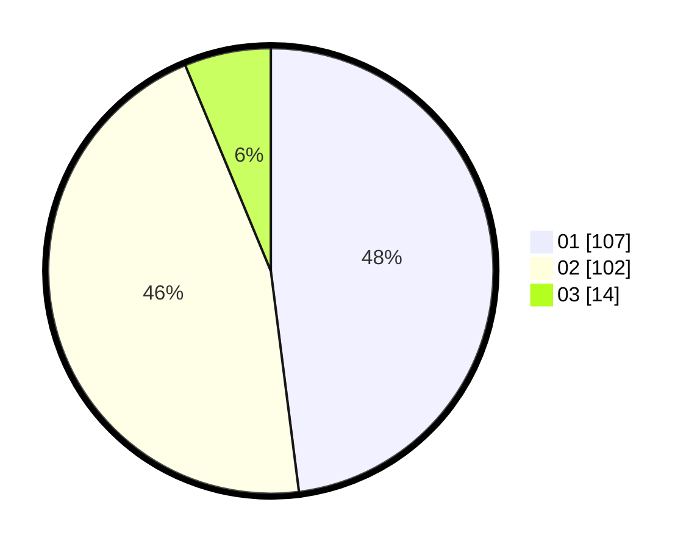

# Hasil

Hasil perolehan suara paslon dapat dilihat pada file paslon-01.txt, paslon-02.txt, dan paslon-03.txt.

Jika tidak ada, artinya data tersebut belum ada pada SIREKAP.

## Perolehan Suara

 * Paslon 01: **107**.
 * Paslon 02: **102**.
 * Paslon 03: **14**.

## Foto C Plano

https://sirekap-obj-formc.kpu.go.id/5f96/pemilu/ppwp/31/72/03/10/03/3172031003188-20240216-021214--c84d06d7-0665-4bcf-9df4-9d10c4060b00.jpg

https://sirekap-obj-formc.kpu.go.id/5f96/pemilu/ppwp/31/72/03/10/03/3172031003188-20240216-021214--b83d47a9-4d8d-448c-b3c6-aa722435d5c6.jpg

https://sirekap-obj-formc.kpu.go.id/5f96/pemilu/ppwp/31/72/03/10/03/3172031003188-20240214-185223--b0e908f8-e0e8-4a2d-a3b5-7192d784f129.jpg

## DATA PEMILIH TETAP

Jumlah pemilih dalam DPT: **0**.
 * L: **0**.
 * P: **0**.

## DATA PENGGUNA HAK PILIH

Jumlah pengguna hak pilih dalam DPT: **0**.
 * L: **0**.
 * P: **0**.

Jumlah pengguna hak pilih dalam DPTb: **0**.
 * L: **0**.
 * P: **0**.

Jumlah pengguna hak pilih dalam DPK: **0**.
 * L: **0**.
 * P: **0**.

Jumlah pengguna hak pilih: **0**.
 * L: **0**.
 * P: **0**.

## JUMLAH SUARA SAH DAN TIDAK SAH

JUMLAH SELURUH SUARA SAH: **223**.

JUMLAH SUARA TIDAK SAH: **3**.

JUMLAH SELURUH SUARA SAH DAN SUARA TIDAK SAH: **226**.
