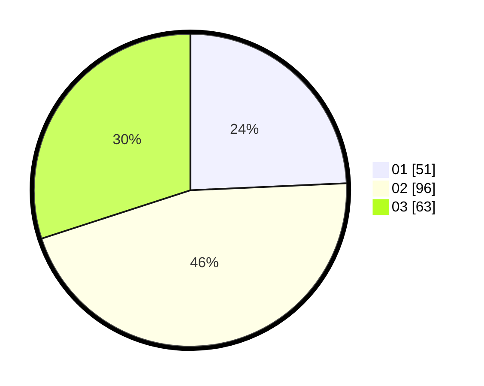

# Hasil

Hasil perolehan suara paslon dapat dilihat pada file paslon-01.txt, paslon-02.txt, dan paslon-03.txt.

Jika tidak ada, artinya data tersebut belum ada pada SIREKAP.

## Perolehan Suara

 * Paslon 01: **51**.
 * Paslon 02: **96**.
 * Paslon 03: **63**.

## Foto C Plano

https://sirekap-obj-formc.kpu.go.id/76d5/pemilu/ppwp/31/72/03/10/03/3172031003189-20240214-193419--52d7f1cf-dcae-49dc-bf68-a023e7a16c35.jpg

https://sirekap-obj-formc.kpu.go.id/76d5/pemilu/ppwp/31/72/03/10/03/3172031003189-20240214-193501--3aec7416-e1f6-4b81-b082-56ba2d08104b.jpg

https://sirekap-obj-formc.kpu.go.id/76d5/pemilu/ppwp/31/72/03/10/03/3172031003189-20240215-021456--fc5f4e49-adb5-4de7-897c-71e76c82d2e4.jpg
