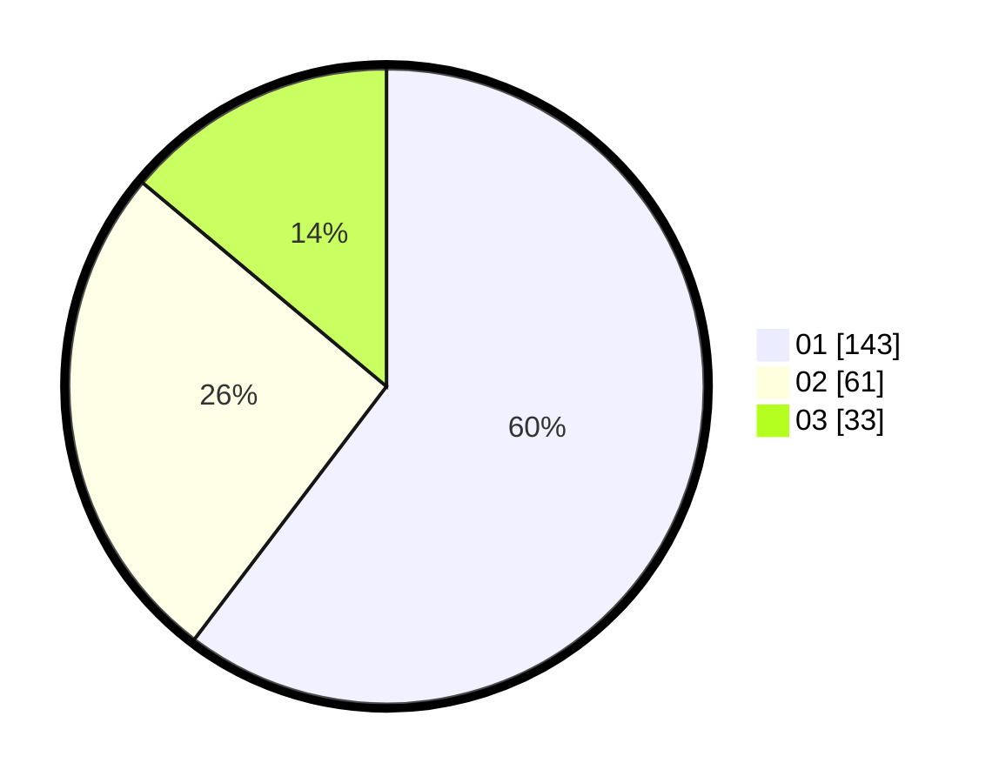

# Hasil

Hasil perolehan suara paslon dapat dilihat pada file paslon-01.txt, paslon-02.txt, dan paslon-03.txt.

Jika tidak ada, artinya data tersebut belum ada pada SIREKAP.

## Perolehan Suara

 * Paslon 01: **143**.
 * Paslon 02: **61**.
 * Paslon 03: **33**.

## Foto C Plano

https://sirekap-obj-formc.kpu.go.id/49da/pemilu/ppwp/31/72/03/10/04/3172031004003-20240216-180241--600ea20c-eb0e-406d-8894-dcf6268b91b1.jpg

https://sirekap-obj-formc.kpu.go.id/49da/pemilu/ppwp/31/72/03/10/04/3172031004003-20240216-180243--fba9e817-1825-4b30-a038-4d00b461eae5.jpg

https://sirekap-obj-formc.kpu.go.id/49da/pemilu/ppwp/31/72/03/10/04/3172031004003-20240216-180242--8af1dae3-9e50-4336-80db-0818afa31e44.jpg

## DATA PEMILIH TETAP

Jumlah pemilih dalam DPT: **291**.
 * L: **149**.
 * P: **142**.

## DATA PENGGUNA HAK PILIH

Jumlah pengguna hak pilih dalam DPT: **233**.
 * L: **114**.
 * P: **119**.

Jumlah pengguna hak pilih dalam DPTb: **4**.
 * L: **1**.
 * P: **3**.

Jumlah pengguna hak pilih dalam DPK: **6**.
 * L: **3**.
 * P: **3**.

Jumlah pengguna hak pilih: **243**.
 * L: **118**.
 * P: **125**.

## JUMLAH SUARA SAH DAN TIDAK SAH

JUMLAH SELURUH SUARA SAH: **237**.

JUMLAH SUARA TIDAK SAH: **6**.

JUMLAH SELURUH SUARA SAH DAN SUARA TIDAK SAH: **243**.
