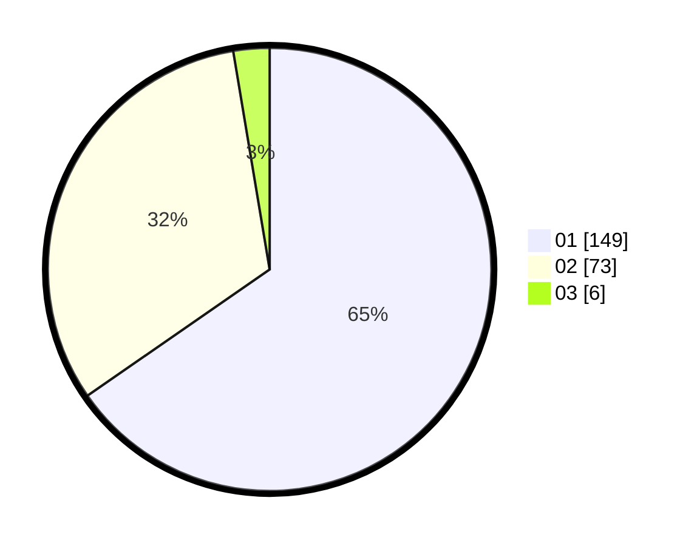

# Hasil

Hasil perolehan suara paslon dapat dilihat pada file paslon-01.txt, paslon-02.txt, dan paslon-03.txt.

Jika tidak ada, artinya data tersebut belum ada pada SIREKAP.

## Perolehan Suara

 * Paslon 01: **149**.
 * Paslon 02: **73**.
 * Paslon 03: **6**.

## Foto C Plano

https://sirekap-obj-formc.kpu.go.id/c9c2/pemilu/ppwp/31/72/03/10/04/3172031004005-20240216-173856--349b4509-a57f-4064-a275-dc7fe91bb0e8.jpg

https://sirekap-obj-formc.kpu.go.id/c9c2/pemilu/ppwp/31/72/03/10/04/3172031004005-20240216-173857--d01073cd-87e8-48cd-a5b5-c7bfc697efe6.jpg

https://sirekap-obj-formc.kpu.go.id/c9c2/pemilu/ppwp/31/72/03/10/04/3172031004005-20240216-173856--85fb6e17-21c2-4cc6-9548-bc10b2dedba2.jpg

## DATA PEMILIH TETAP

Jumlah pemilih dalam DPT: **284**.
 * L: **138**.
 * P: **146**.

## DATA PENGGUNA HAK PILIH

Jumlah pengguna hak pilih dalam DPT: **228**.
 * L: **105**.
 * P: **123**.

Jumlah pengguna hak pilih dalam DPTb: **0**.
 * L: **0**.
 * P: **0**.

Jumlah pengguna hak pilih dalam DPK: **5**.
 * L: **3**.
 * P: **2**.

Jumlah pengguna hak pilih: **233**.
 * L: **108**.
 * P: **125**.

## JUMLAH SUARA SAH DAN TIDAK SAH

JUMLAH SELURUH SUARA SAH: **228**.

JUMLAH SUARA TIDAK SAH: **5**.

JUMLAH SELURUH SUARA SAH DAN SUARA TIDAK SAH: **233**.
