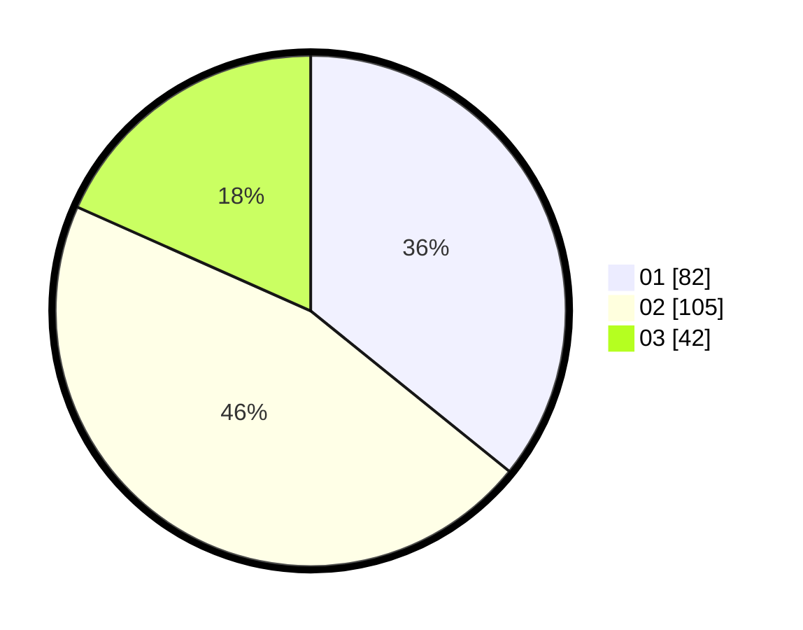

# Hasil

Hasil perolehan suara paslon dapat dilihat pada file paslon-01.txt, paslon-02.txt, dan paslon-03.txt.

Jika tidak ada, artinya data tersebut belum ada pada SIREKAP.

## Perolehan Suara

 * Paslon 01: **82**.
 * Paslon 02: **105**.
 * Paslon 03: **42**.

## Foto C Plano

https://sirekap-obj-formc.kpu.go.id/dac9/pemilu/ppwp/31/72/03/10/04/3172031004012-20240214-202311--c584dba0-c8c1-40d9-980a-9ea7cf8e5828.jpg

https://sirekap-obj-formc.kpu.go.id/dac9/pemilu/ppwp/31/72/03/10/04/3172031004012-20240214-222147--587a4070-825a-4c04-939b-23f5b7f2741c.jpg

https://sirekap-obj-formc.kpu.go.id/dac9/pemilu/ppwp/31/72/03/10/04/3172031004012-20240214-203043--c252314a-13d1-4045-9800-2bfcf1696b90.jpg

## DATA PEMILIH TETAP

Jumlah pemilih dalam DPT: **285**.
 * L: **150**.
 * P: **135**.

## DATA PENGGUNA HAK PILIH

Jumlah pengguna hak pilih dalam DPT: **229**.
 * L: **118**.
 * P: **111**.

Jumlah pengguna hak pilih dalam DPTb: **2**.
 * L: **2**.
 * P: **0**.

Jumlah pengguna hak pilih dalam DPK: **0**.
 * L: **0**.
 * P: **0**.

Jumlah pengguna hak pilih: **231**.
 * L: **120**.
 * P: **111**.

## JUMLAH SUARA SAH DAN TIDAK SAH

JUMLAH SELURUH SUARA SAH: **229**.

JUMLAH SUARA TIDAK SAH: **2**.

JUMLAH SELURUH SUARA SAH DAN SUARA TIDAK SAH: **231**.
