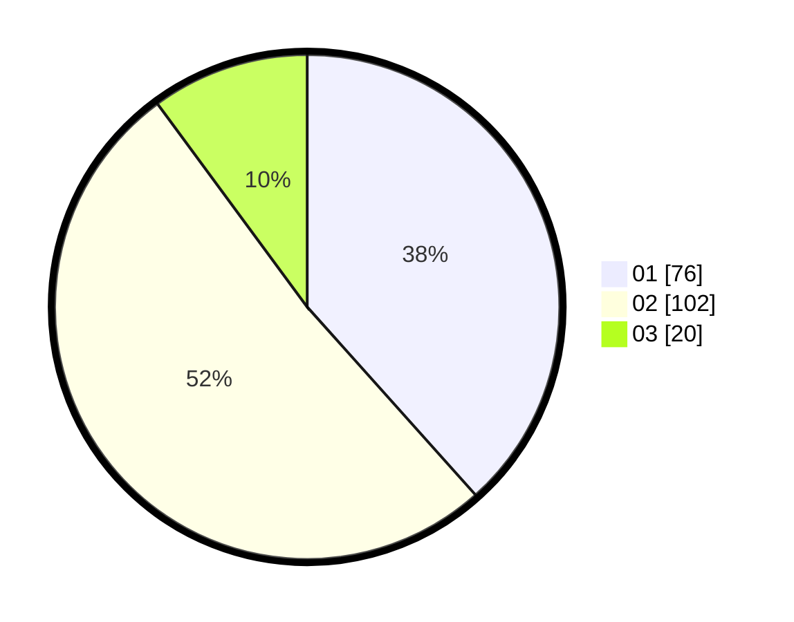

# Hasil

Hasil perolehan suara paslon dapat dilihat pada file paslon-01.txt, paslon-02.txt, dan paslon-03.txt.

Jika tidak ada, artinya data tersebut belum ada pada SIREKAP.

## Perolehan Suara

 * Paslon 01: **76**.
 * Paslon 02: **102**.
 * Paslon 03: **20**.

## Foto C Plano

https://sirekap-obj-formc.kpu.go.id/54d2/pemilu/ppwp/31/72/03/10/04/3172031004022-20240214-202510--7f09bc57-3619-49f6-ab1c-c04b6715f9cf.jpg

https://sirekap-obj-formc.kpu.go.id/54d2/pemilu/ppwp/31/72/03/10/04/3172031004022-20240214-202818--769ffec4-0abf-46da-9544-82da3d859471.jpg

https://sirekap-obj-formc.kpu.go.id/54d2/pemilu/ppwp/31/72/03/10/04/3172031004022-20240214-203039--5eeb1d80-4197-4409-a9a3-edf1ba9cd03f.jpg

## DATA PEMILIH TETAP

Jumlah pemilih dalam DPT: **194**.
 * L: **96**.
 * P: **98**.

## DATA PENGGUNA HAK PILIH

Jumlah pengguna hak pilih dalam DPT: **286**.
 * L: **151**.
 * P: **135**.

Jumlah pengguna hak pilih dalam DPTb: **1**.
 * L: **0**.
 * P: **1**.

Jumlah pengguna hak pilih dalam DPK: **4**.
 * L: **1**.
 * P: **3**.

Jumlah pengguna hak pilih: **291**.
 * L: **152**.
 * P: **139**.

## JUMLAH SUARA SAH DAN TIDAK SAH

JUMLAH SELURUH SUARA SAH: **198**.

JUMLAH SUARA TIDAK SAH: **1**.

JUMLAH SELURUH SUARA SAH DAN SUARA TIDAK SAH: **199**.
