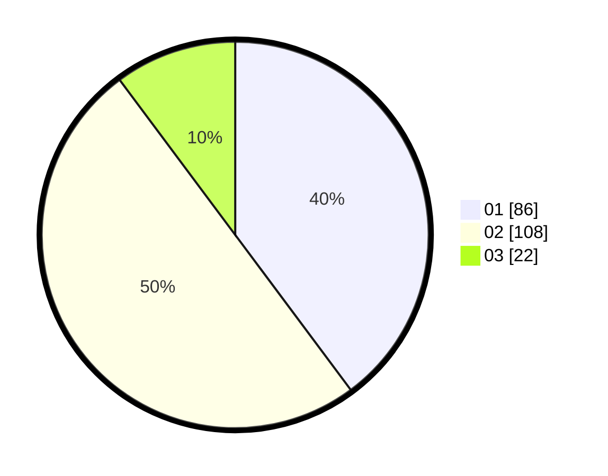

# Hasil

Hasil perolehan suara paslon dapat dilihat pada file paslon-01.txt, paslon-02.txt, dan paslon-03.txt.

Jika tidak ada, artinya data tersebut belum ada pada SIREKAP.

## Perolehan Suara

 * Paslon 01: **86**.
 * Paslon 02: **108**.
 * Paslon 03: **22**.

## Foto C Plano

https://sirekap-obj-formc.kpu.go.id/0c19/pemilu/ppwp/31/72/03/10/04/3172031004024-20240215-034952--e4910e24-1c96-474d-bf9f-42574c4eba05.jpg

https://sirekap-obj-formc.kpu.go.id/0c19/pemilu/ppwp/31/72/03/10/04/3172031004024-20240215-035021--f62d4579-306c-497f-a90d-bd626caa1ac0.jpg

https://sirekap-obj-formc.kpu.go.id/0c19/pemilu/ppwp/31/72/03/10/04/3172031004024-20240215-035011--f82f8273-2c54-4951-b57f-2b847caea8cb.jpg

## DATA PEMILIH TETAP

Jumlah pemilih dalam DPT: **0**.
 * L: **0**.
 * P: **0**.

## DATA PENGGUNA HAK PILIH

Jumlah pengguna hak pilih dalam DPT: **0**.
 * L: **0**.
 * P: **0**.

Jumlah pengguna hak pilih dalam DPTb: **0**.
 * L: **0**.
 * P: **0**.

Jumlah pengguna hak pilih dalam DPK: **0**.
 * L: **0**.
 * P: **0**.

Jumlah pengguna hak pilih: **0**.
 * L: **0**.
 * P: **0**.

## JUMLAH SUARA SAH DAN TIDAK SAH

JUMLAH SELURUH SUARA SAH: **216**.

JUMLAH SUARA TIDAK SAH: **4**.

JUMLAH SELURUH SUARA SAH DAN SUARA TIDAK SAH: **220**.
