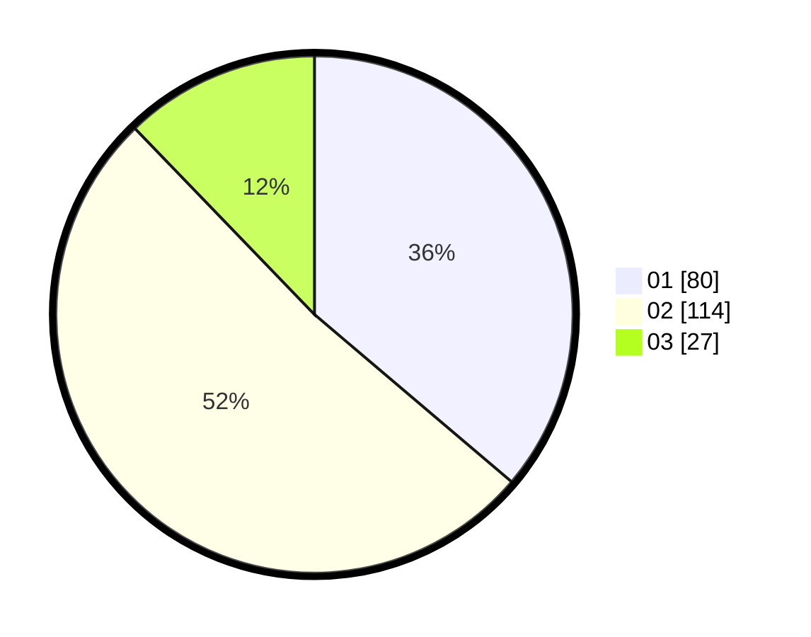

# Hasil

Hasil perolehan suara paslon dapat dilihat pada file paslon-01.txt, paslon-02.txt, dan paslon-03.txt.

Jika tidak ada, artinya data tersebut belum ada pada SIREKAP.

## Perolehan Suara

 * Paslon 01: **80**.
 * Paslon 02: **114**.
 * Paslon 03: **27**.

## Foto C Plano

https://sirekap-obj-formc.kpu.go.id/86b0/pemilu/ppwp/31/72/03/10/04/3172031004025-20240215-145544--92f637e2-2b86-4524-b8e4-555176395c54.jpg

https://sirekap-obj-formc.kpu.go.id/86b0/pemilu/ppwp/31/72/03/10/04/3172031004025-20240215-145606--6951ad94-3ddd-4b37-971a-8fa4bf18b655.jpg

https://sirekap-obj-formc.kpu.go.id/86b0/pemilu/ppwp/31/72/03/10/04/3172031004025-20240215-145555--fee7785c-d82d-425c-86e8-ed4f14a7a48c.jpg

## DATA PEMILIH TETAP

Jumlah pemilih dalam DPT: **289**.
 * L: **146**.
 * P: **143**.

## DATA PENGGUNA HAK PILIH

Jumlah pengguna hak pilih dalam DPT: **224**.
 * L: **115**.
 * P: **109**.

Jumlah pengguna hak pilih dalam DPTb: **0**.
 * L: **0**.
 * P: **0**.

Jumlah pengguna hak pilih dalam DPK: **0**.
 * L: **0**.
 * P: **0**.

Jumlah pengguna hak pilih: **224**.
 * L: **115**.
 * P: **109**.

## JUMLAH SUARA SAH DAN TIDAK SAH

JUMLAH SELURUH SUARA SAH: **221**.

JUMLAH SUARA TIDAK SAH: **3**.

JUMLAH SELURUH SUARA SAH DAN SUARA TIDAK SAH: **224**.
