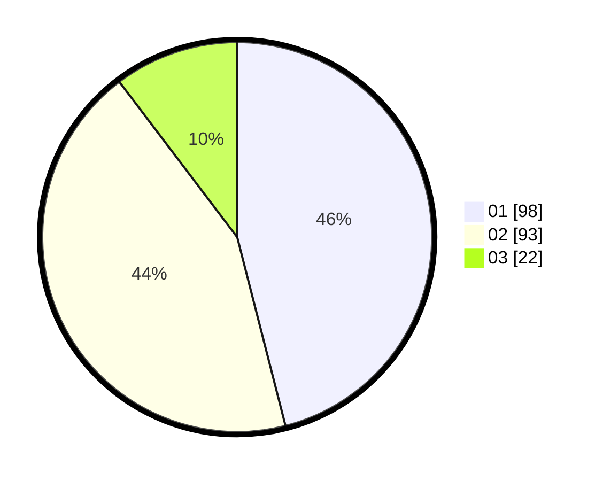

# Hasil

Hasil perolehan suara paslon dapat dilihat pada file paslon-01.txt, paslon-02.txt, dan paslon-03.txt.

Jika tidak ada, artinya data tersebut belum ada pada SIREKAP.

## Perolehan Suara

 * Paslon 01: **98**.
 * Paslon 02: **93**.
 * Paslon 03: **22**.

## Foto C Plano

https://sirekap-obj-formc.kpu.go.id/5a03/pemilu/ppwp/31/72/03/10/04/3172031004027-20240216-180205--64e94a2b-ebe3-4091-b430-a02ebe02cdee.jpg

https://sirekap-obj-formc.kpu.go.id/5a03/pemilu/ppwp/31/72/03/10/04/3172031004027-20240216-180207--dd076b18-e4c3-426b-bb0b-40bddfeac190.jpg

https://sirekap-obj-formc.kpu.go.id/5a03/pemilu/ppwp/31/72/03/10/04/3172031004027-20240216-180206--c2e90262-aec9-4b53-8477-1d2d70679dc6.jpg

## DATA PEMILIH TETAP

Jumlah pemilih dalam DPT: **286**.
 * L: **145**.
 * P: **141**.

## DATA PENGGUNA HAK PILIH

Jumlah pengguna hak pilih dalam DPT: **212**.
 * L: **103**.
 * P: **109**.

Jumlah pengguna hak pilih dalam DPTb: **0**.
 * L: **0**.
 * P: **0**.

Jumlah pengguna hak pilih dalam DPK: **2**.
 * L: **0**.
 * P: **2**.

Jumlah pengguna hak pilih: **214**.
 * L: **103**.
 * P: **111**.

## JUMLAH SUARA SAH DAN TIDAK SAH

JUMLAH SELURUH SUARA SAH: **213**.

JUMLAH SUARA TIDAK SAH: **1**.

JUMLAH SELURUH SUARA SAH DAN SUARA TIDAK SAH: **214**.
