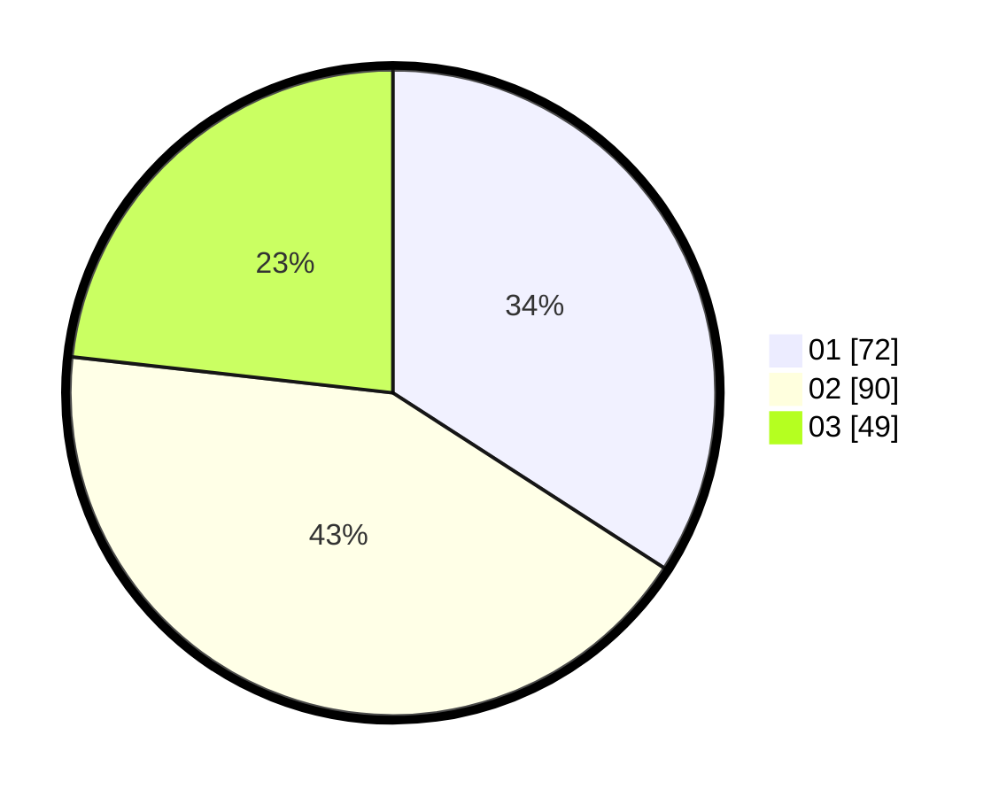

# Hasil

Hasil perolehan suara paslon dapat dilihat pada file paslon-01.txt, paslon-02.txt, dan paslon-03.txt.

Jika tidak ada, artinya data tersebut belum ada pada SIREKAP.

## Perolehan Suara

 * Paslon 01: **72**.
 * Paslon 02: **90**.
 * Paslon 03: **49**.

## Foto C Plano

https://sirekap-obj-formc.kpu.go.id/1dfd/pemilu/ppwp/31/72/03/10/04/3172031004028-20240214-193634--279afec6-6d48-4130-96f8-0eaa75a50b5d.jpg

https://sirekap-obj-formc.kpu.go.id/1dfd/pemilu/ppwp/31/72/03/10/04/3172031004028-20240214-193637--1422dee5-203e-4d85-9885-572a5ae641ba.jpg

https://sirekap-obj-formc.kpu.go.id/1dfd/pemilu/ppwp/31/72/03/10/04/3172031004028-20240214-193640--c1cb6ab6-33ac-4d84-b5b1-b7010a06db72.jpg

## DATA PEMILIH TETAP

Jumlah pemilih dalam DPT: **284**.
 * L: **150**.
 * P: **134**.

## DATA PENGGUNA HAK PILIH

Jumlah pengguna hak pilih dalam DPT: **215**.
 * L: **100**.
 * P: **115**.

Jumlah pengguna hak pilih dalam DPTb: **0**.
 * L: **0**.
 * P: **0**.

Jumlah pengguna hak pilih dalam DPK: **0**.
 * L: **0**.
 * P: **0**.

Jumlah pengguna hak pilih: **215**.
 * L: **100**.
 * P: **115**.

## JUMLAH SUARA SAH DAN TIDAK SAH

JUMLAH SELURUH SUARA SAH: **211**.

JUMLAH SUARA TIDAK SAH: **4**.

JUMLAH SELURUH SUARA SAH DAN SUARA TIDAK SAH: **215**.
