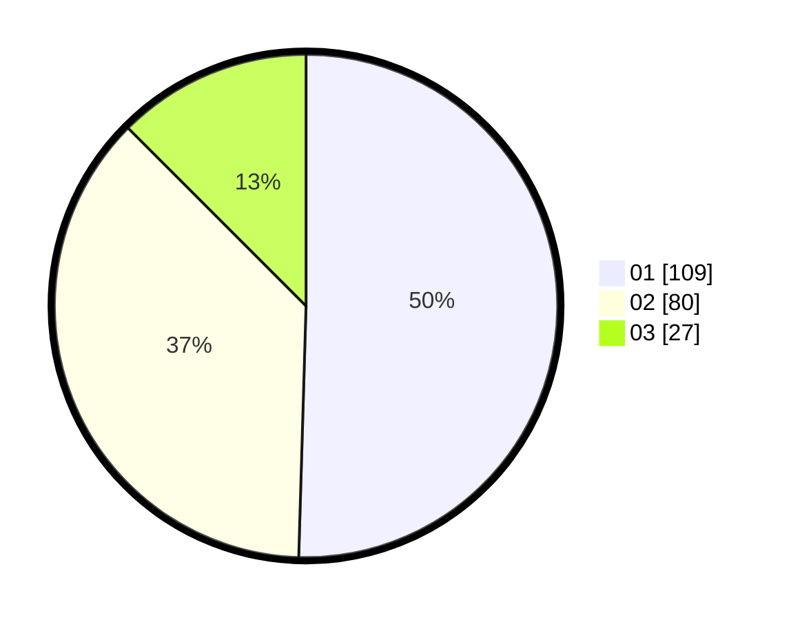

# Hasil

Hasil perolehan suara paslon dapat dilihat pada file paslon-01.txt, paslon-02.txt, dan paslon-03.txt.

Jika tidak ada, artinya data tersebut belum ada pada SIREKAP.

## Perolehan Suara

 * Paslon 01: **109**.
 * Paslon 02: **80**.
 * Paslon 03: **27**.

## Foto C Plano

https://sirekap-obj-formc.kpu.go.id/a361/pemilu/ppwp/31/72/03/10/04/3172031004030-20240215-010626--40ff039c-fd64-4184-9e2d-42ee0be75b03.jpg

https://sirekap-obj-formc.kpu.go.id/a361/pemilu/ppwp/31/72/03/10/04/3172031004030-20240216-130153--8c2d786d-d5b6-4d91-8ba0-36e8322e4341.jpg

https://sirekap-obj-formc.kpu.go.id/a361/pemilu/ppwp/31/72/03/10/04/3172031004030-20240216-130152--d3d34851-f7a2-4e5a-808f-f1b0cdd143d6.jpg

## DATA PEMILIH TETAP

Jumlah pemilih dalam DPT: **273**.
 * L: **142**.
 * P: **131**.

## DATA PENGGUNA HAK PILIH

Jumlah pengguna hak pilih dalam DPT: **217**.
 * L: **105**.
 * P: **112**.

Jumlah pengguna hak pilih dalam DPTb: **1**.
 * L: **1**.
 * P: **0**.

Jumlah pengguna hak pilih dalam DPK: **2**.
 * L: **1**.
 * P: **1**.

Jumlah pengguna hak pilih: **220**.
 * L: **107**.
 * P: **113**.

## JUMLAH SUARA SAH DAN TIDAK SAH

JUMLAH SELURUH SUARA SAH: **216**.

JUMLAH SUARA TIDAK SAH: **4**.

JUMLAH SELURUH SUARA SAH DAN SUARA TIDAK SAH: **220**.
