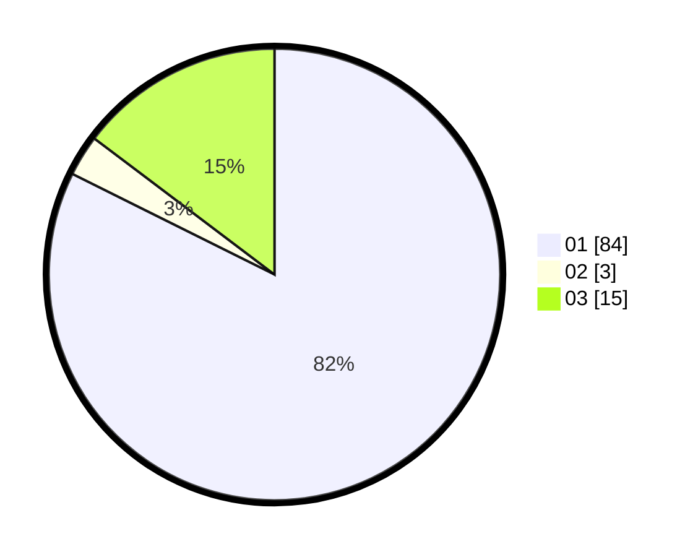

# Hasil

Hasil perolehan suara paslon dapat dilihat pada file paslon-01.txt, paslon-02.txt, dan paslon-03.txt.

Jika tidak ada, artinya data tersebut belum ada pada SIREKAP.

## Perolehan Suara

 * Paslon 01: **84**.
 * Paslon 02: **3**.
 * Paslon 03: **15**.

## Foto C Plano

https://sirekap-obj-formc.kpu.go.id/a045/pemilu/ppwp/31/72/03/10/04/3172031004041-20240214-232539--6d402245-b62d-47b3-9e49-ea1f72f5052f.jpg

https://sirekap-obj-formc.kpu.go.id/a045/pemilu/ppwp/31/72/03/10/04/3172031004041-20240214-232616--59022ac2-db68-4dda-94c9-25a8311021d0.jpg

https://sirekap-obj-formc.kpu.go.id/a045/pemilu/ppwp/31/72/03/10/04/3172031004041-20240214-232659--2e95afb1-0126-4a2f-9546-c75371465ad1.jpg

## DATA PEMILIH TETAP

Jumlah pemilih dalam DPT: **279**.
 * L: **133**.
 * P: **146**.

## DATA PENGGUNA HAK PILIH

Jumlah pengguna hak pilih dalam DPT: **203**.
 * L: **95**.
 * P: **108**.

Jumlah pengguna hak pilih dalam DPTb: **0**.
 * L: **0**.
 * P: **0**.

Jumlah pengguna hak pilih dalam DPK: **2**.
 * L: **0**.
 * P: **2**.

Jumlah pengguna hak pilih: **205**.
 * L: **95**.
 * P: **110**.

## JUMLAH SUARA SAH DAN TIDAK SAH

JUMLAH SELURUH SUARA SAH: **202**.

JUMLAH SUARA TIDAK SAH: **3**.

JUMLAH SELURUH SUARA SAH DAN SUARA TIDAK SAH: **205**.
