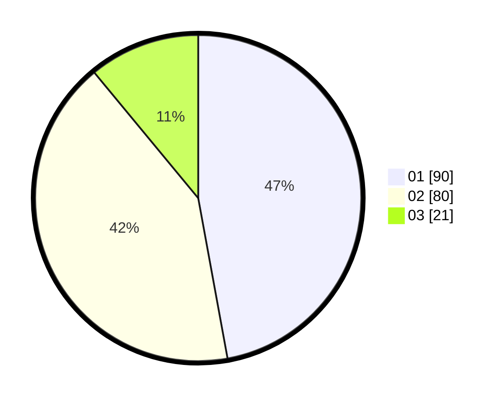

# Hasil

Hasil perolehan suara paslon dapat dilihat pada file paslon-01.txt, paslon-02.txt, dan paslon-03.txt.

Jika tidak ada, artinya data tersebut belum ada pada SIREKAP.

## Perolehan Suara

 * Paslon 01: **90**.
 * Paslon 02: **80**.
 * Paslon 03: **21**.

## Foto C Plano

https://sirekap-obj-formc.kpu.go.id/5201/pemilu/ppwp/31/72/03/10/04/3172031004044-20240214-155420--095990d9-5f18-473d-bad4-66b2fb441818.jpg

https://sirekap-obj-formc.kpu.go.id/5201/pemilu/ppwp/31/72/03/10/04/3172031004044-20240214-235348--213e28b5-b08d-4125-8338-fdaa7044635f.jpg

https://sirekap-obj-formc.kpu.go.id/5201/pemilu/ppwp/31/72/03/10/04/3172031004044-20240214-155759--938bcb1b-141a-45bc-9b0e-7d7b1c189838.jpg

## DATA PEMILIH TETAP

Jumlah pemilih dalam DPT: **282**.
 * L: **132**.
 * P: **150**.

## DATA PENGGUNA HAK PILIH

Jumlah pengguna hak pilih dalam DPT: **193**.
 * L: **84**.
 * P: **109**.

Jumlah pengguna hak pilih dalam DPTb: **0**.
 * L: **0**.
 * P: **0**.

Jumlah pengguna hak pilih dalam DPK: **0**.
 * L: **0**.
 * P: **0**.

Jumlah pengguna hak pilih: **193**.
 * L: **84**.
 * P: **109**.

## JUMLAH SUARA SAH DAN TIDAK SAH

JUMLAH SELURUH SUARA SAH: **191**.

JUMLAH SUARA TIDAK SAH: **2**.

JUMLAH SELURUH SUARA SAH DAN SUARA TIDAK SAH: **193**.
