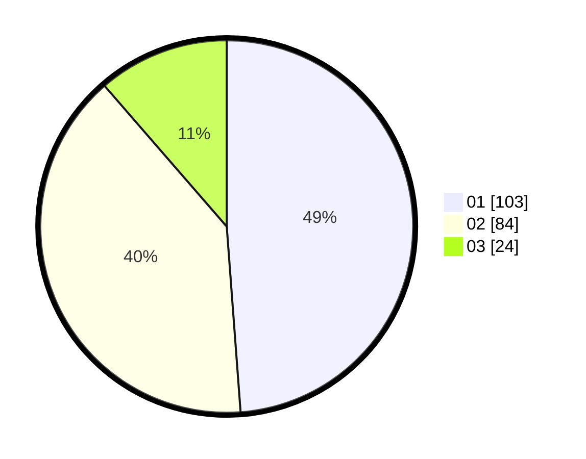

# Hasil

Hasil perolehan suara paslon dapat dilihat pada file paslon-01.txt, paslon-02.txt, dan paslon-03.txt.

Jika tidak ada, artinya data tersebut belum ada pada SIREKAP.

## Perolehan Suara

 * Paslon 01: **103**.
 * Paslon 02: **84**.
 * Paslon 03: **24**.

## Foto C Plano

https://sirekap-obj-formc.kpu.go.id/a1a8/pemilu/ppwp/31/72/03/10/04/3172031004045-20240214-192631--44a5a876-6740-42a9-8b19-9c25d3c82002.jpg

https://sirekap-obj-formc.kpu.go.id/a1a8/pemilu/ppwp/31/72/03/10/04/3172031004045-20240214-192639--2a42f48c-4ccc-4c84-adfc-8ad394ce7801.jpg

https://sirekap-obj-formc.kpu.go.id/a1a8/pemilu/ppwp/31/72/03/10/04/3172031004045-20240214-192645--33ba7525-ae84-4efd-91ba-878fcf83d885.jpg

## DATA PEMILIH TETAP

Jumlah pemilih dalam DPT: **282**.
 * L: **142**.
 * P: **140**.

## DATA PENGGUNA HAK PILIH

Jumlah pengguna hak pilih dalam DPT: **212**.
 * L: **113**.
 * P: **99**.

Jumlah pengguna hak pilih dalam DPTb: **1**.
 * L: **1**.
 * P: **0**.

Jumlah pengguna hak pilih dalam DPK: **1**.
 * L: **0**.
 * P: **1**.

Jumlah pengguna hak pilih: **214**.
 * L: **114**.
 * P: **100**.

## JUMLAH SUARA SAH DAN TIDAK SAH

JUMLAH SELURUH SUARA SAH: **211**.

JUMLAH SUARA TIDAK SAH: **3**.

JUMLAH SELURUH SUARA SAH DAN SUARA TIDAK SAH: **214**.
