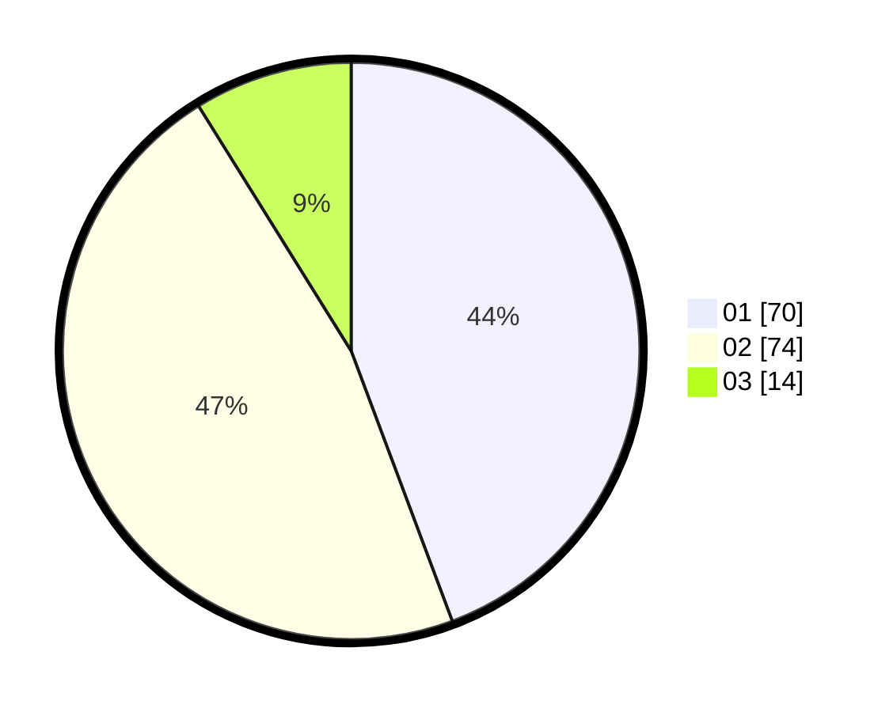

# Hasil

Hasil perolehan suara paslon dapat dilihat pada file paslon-01.txt, paslon-02.txt, dan paslon-03.txt.

Jika tidak ada, artinya data tersebut belum ada pada SIREKAP.

## Perolehan Suara

 * Paslon 01: **70**.
 * Paslon 02: **74**.
 * Paslon 03: **14**.

## Foto C Plano

https://sirekap-obj-formc.kpu.go.id/b5dc/pemilu/ppwp/31/72/03/10/04/3172031004047-20240215-000533--0a9ad0b0-3ee1-448b-9aec-c4f5624bb3ec.jpg

https://sirekap-obj-formc.kpu.go.id/b5dc/pemilu/ppwp/31/72/03/10/04/3172031004047-20240215-000811--e39a106f-c7a1-4c90-97c9-780aad8cd6dc.jpg

https://sirekap-obj-formc.kpu.go.id/b5dc/pemilu/ppwp/31/72/03/10/04/3172031004047-20240215-001136--fc2994c1-96db-4715-94a3-7479a07e255b.jpg

## DATA PEMILIH TETAP

Jumlah pemilih dalam DPT: **233**.
 * L: **109**.
 * P: **124**.

## DATA PENGGUNA HAK PILIH

Jumlah pengguna hak pilih dalam DPT: **233**.
 * L: **109**.
 * P: **124**.

Jumlah pengguna hak pilih dalam DPTb: **0**.
 * L: **0**.
 * P: **0**.

Jumlah pengguna hak pilih dalam DPK: **5**.
 * L: **2**.
 * P: **3**.

Jumlah pengguna hak pilih: **238**.
 * L: **111**.
 * P: **127**.

## JUMLAH SUARA SAH DAN TIDAK SAH

JUMLAH SELURUH SUARA SAH: **158**.

JUMLAH SUARA TIDAK SAH: **3**.

JUMLAH SELURUH SUARA SAH DAN SUARA TIDAK SAH: **161**.
