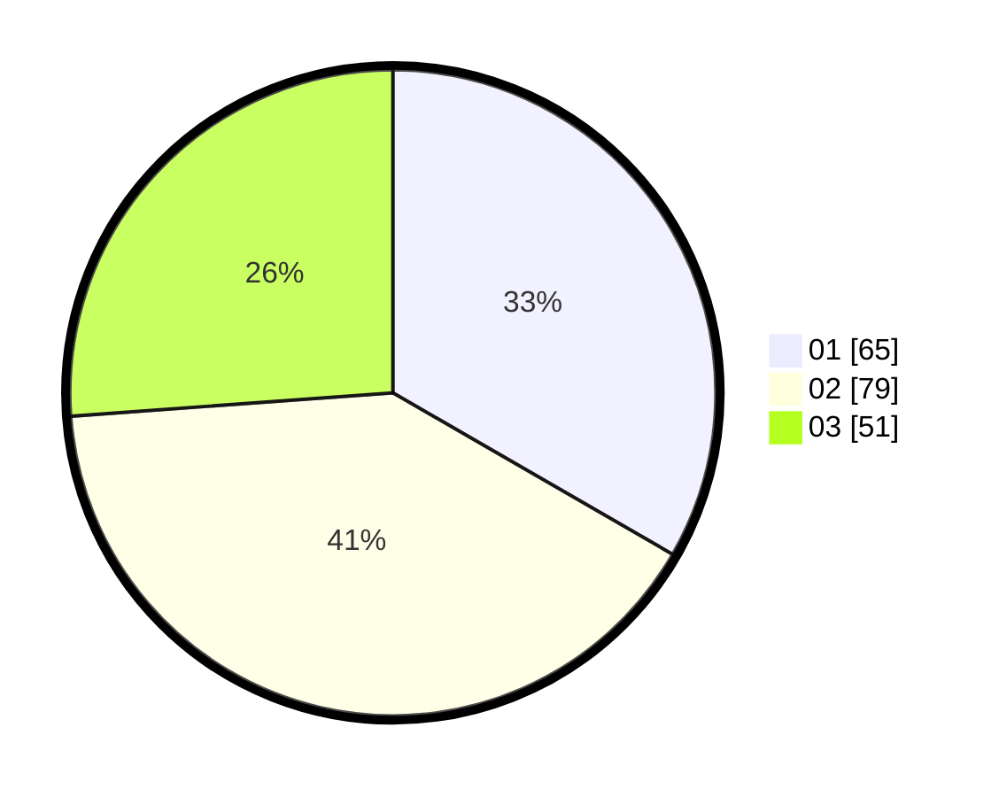

# Hasil

Hasil perolehan suara paslon dapat dilihat pada file paslon-01.txt, paslon-02.txt, dan paslon-03.txt.

Jika tidak ada, artinya data tersebut belum ada pada SIREKAP.

## Perolehan Suara

 * Paslon 01: **65**.
 * Paslon 02: **79**.
 * Paslon 03: **51**.

## Foto C Plano

https://sirekap-obj-formc.kpu.go.id/ee1c/pemilu/ppwp/31/72/03/10/04/3172031004049-20240214-191214--e314dd72-5c6b-4c59-a0f3-7b19e5c81ab1.jpg

https://sirekap-obj-formc.kpu.go.id/ee1c/pemilu/ppwp/31/72/03/10/04/3172031004049-20240214-191456--6a7fbd04-a0f0-41be-b619-f95c942a188c.jpg

https://sirekap-obj-formc.kpu.go.id/ee1c/pemilu/ppwp/31/72/03/10/04/3172031004049-20240214-191641--60cb523e-ef0b-4ff0-9d32-acd3ff431eaa.jpg

## DATA PEMILIH TETAP

Jumlah pemilih dalam DPT: **284**.
 * L: **136**.
 * P: **148**.

## DATA PENGGUNA HAK PILIH

Jumlah pengguna hak pilih dalam DPT: **197**.
 * L: **95**.
 * P: **102**.

Jumlah pengguna hak pilih dalam DPTb: **1**.
 * L: **1**.
 * P: **0**.

Jumlah pengguna hak pilih dalam DPK: **0**.
 * L: **0**.
 * P: **0**.

Jumlah pengguna hak pilih: **198**.
 * L: **96**.
 * P: **102**.

## JUMLAH SUARA SAH DAN TIDAK SAH

JUMLAH SELURUH SUARA SAH: **195**.

JUMLAH SUARA TIDAK SAH: **3**.

JUMLAH SELURUH SUARA SAH DAN SUARA TIDAK SAH: **198**.
