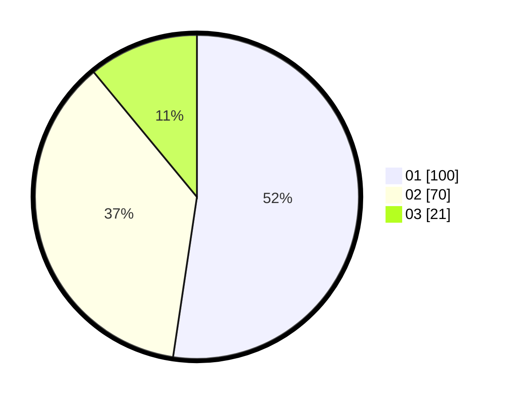

# Hasil

Hasil perolehan suara paslon dapat dilihat pada file paslon-01.txt, paslon-02.txt, dan paslon-03.txt.

Jika tidak ada, artinya data tersebut belum ada pada SIREKAP.

## Perolehan Suara

 * Paslon 01: **100**.
 * Paslon 02: **70**.
 * Paslon 03: **21**.

## Foto C Plano

https://sirekap-obj-formc.kpu.go.id/b211/pemilu/ppwp/31/72/03/10/04/3172031004053-20240215-004636--98402100-250a-444f-92c3-6c7ade73b73f.jpg

https://sirekap-obj-formc.kpu.go.id/b211/pemilu/ppwp/31/72/03/10/04/3172031004053-20240215-004717--366f37da-cfaa-4dd0-a084-589d9953976f.jpg

https://sirekap-obj-formc.kpu.go.id/b211/pemilu/ppwp/31/72/03/10/04/3172031004053-20240218-222035--8d4e9845-00f3-44bb-8669-21456b4ef8f6.jpg

## DATA PEMILIH TETAP

Jumlah pemilih dalam DPT: **263**.
 * L: **129**.
 * P: **134**.

## DATA PENGGUNA HAK PILIH

Jumlah pengguna hak pilih dalam DPT: **194**.
 * L: **91**.
 * P: **103**.

Jumlah pengguna hak pilih dalam DPTb: **0**.
 * L: **0**.
 * P: **0**.

Jumlah pengguna hak pilih dalam DPK: **2**.
 * L: **2**.
 * P: **0**.

Jumlah pengguna hak pilih: **196**.
 * L: **93**.
 * P: **103**.

## JUMLAH SUARA SAH DAN TIDAK SAH

JUMLAH SELURUH SUARA SAH: **191**.

JUMLAH SUARA TIDAK SAH: **5**.

JUMLAH SELURUH SUARA SAH DAN SUARA TIDAK SAH: **196**.
