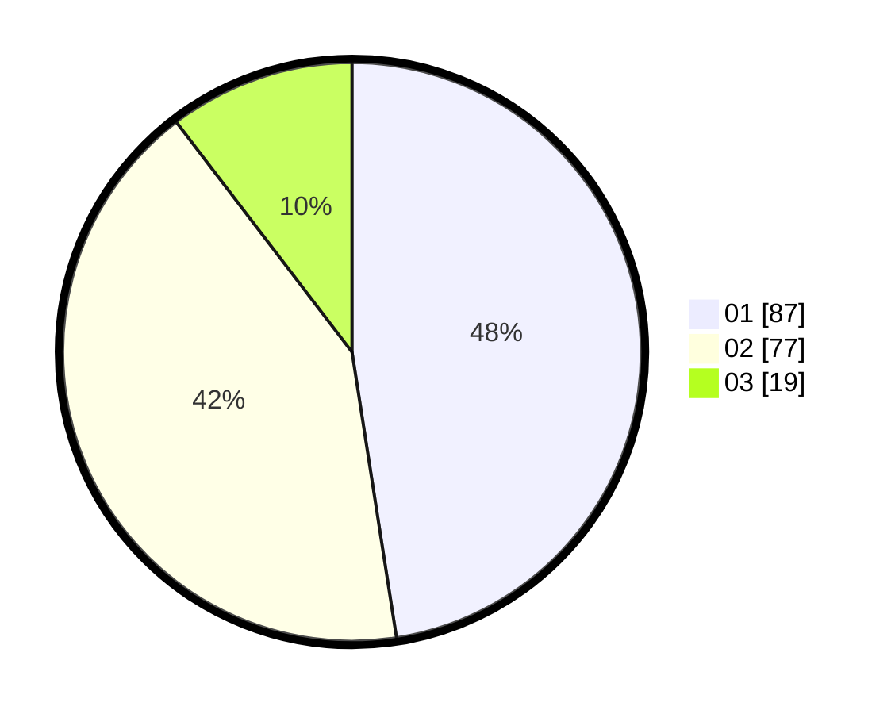

# Hasil

Hasil perolehan suara paslon dapat dilihat pada file paslon-01.txt, paslon-02.txt, dan paslon-03.txt.

Jika tidak ada, artinya data tersebut belum ada pada SIREKAP.

## Perolehan Suara

 * Paslon 01: **87**.
 * Paslon 02: **77**.
 * Paslon 03: **19**.

## Foto C Plano

https://sirekap-obj-formc.kpu.go.id/aee9/pemilu/ppwp/31/72/03/10/04/3172031004054-20240215-205719--25ccbd52-2b65-485c-b785-2423ec8bd223.jpg

https://sirekap-obj-formc.kpu.go.id/aee9/pemilu/ppwp/31/72/03/10/04/3172031004054-20240215-205721--0ef7e075-3c49-46f7-9860-de7522d0f1db.jpg

https://sirekap-obj-formc.kpu.go.id/aee9/pemilu/ppwp/31/72/03/10/04/3172031004054-20240215-205720--b48e0d43-79b9-4b47-92e3-df319eccab70.jpg

## DATA PEMILIH TETAP

Jumlah pemilih dalam DPT: **264**.
 * L: **143**.
 * P: **121**.

## DATA PENGGUNA HAK PILIH

Jumlah pengguna hak pilih dalam DPT: **185**.
 * L: **91**.
 * P: **94**.

Jumlah pengguna hak pilih dalam DPTb: **0**.
 * L: **0**.
 * P: **0**.

Jumlah pengguna hak pilih dalam DPK: **2**.
 * L: **0**.
 * P: **2**.

Jumlah pengguna hak pilih: **187**.
 * L: **91**.
 * P: **96**.

## JUMLAH SUARA SAH DAN TIDAK SAH

JUMLAH SELURUH SUARA SAH: **183**.

JUMLAH SUARA TIDAK SAH: **4**.

JUMLAH SELURUH SUARA SAH DAN SUARA TIDAK SAH: **187**.
