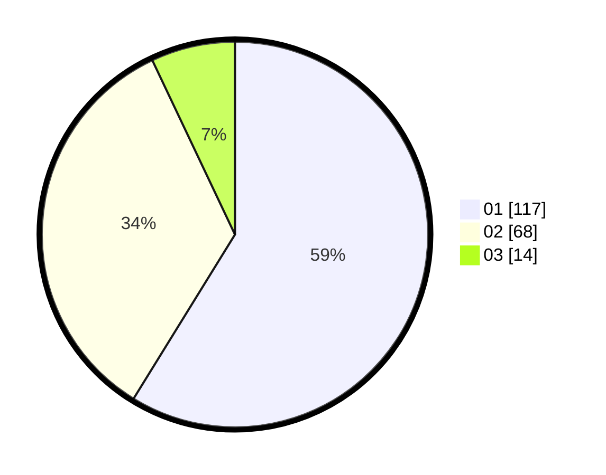

# Hasil

Hasil perolehan suara paslon dapat dilihat pada file paslon-01.txt, paslon-02.txt, dan paslon-03.txt.

Jika tidak ada, artinya data tersebut belum ada pada SIREKAP.

## Perolehan Suara

 * Paslon 01: **117**.
 * Paslon 02: **68**.
 * Paslon 03: **14**.

## Foto C Plano

https://sirekap-obj-formc.kpu.go.id/083b/pemilu/ppwp/31/72/03/10/04/3172031004055-20240216-074039--91af1ee2-8d50-4f86-93bb-4fa15294c419.jpg

https://sirekap-obj-formc.kpu.go.id/083b/pemilu/ppwp/31/72/03/10/04/3172031004055-20240216-074040--206119a5-b1e1-4217-b2d3-858312f622fe.jpg

https://sirekap-obj-formc.kpu.go.id/083b/pemilu/ppwp/31/72/03/10/04/3172031004055-20240216-074039--cf451f87-98c0-469b-9601-f05a3cdd2b7c.jpg

## DATA PEMILIH TETAP

Jumlah pemilih dalam DPT: **263**.
 * L: **130**.
 * P: **133**.

## DATA PENGGUNA HAK PILIH

Jumlah pengguna hak pilih dalam DPT: **203**.
 * L: **97**.
 * P: **106**.

Jumlah pengguna hak pilih dalam DPTb: **0**.
 * L: **0**.
 * P: **0**.

Jumlah pengguna hak pilih dalam DPK: **0**.
 * L: **0**.
 * P: **0**.

Jumlah pengguna hak pilih: **203**.
 * L: **97**.
 * P: **106**.

## JUMLAH SUARA SAH DAN TIDAK SAH

JUMLAH SELURUH SUARA SAH: **199**.

JUMLAH SUARA TIDAK SAH: **4**.

JUMLAH SELURUH SUARA SAH DAN SUARA TIDAK SAH: **203**.
