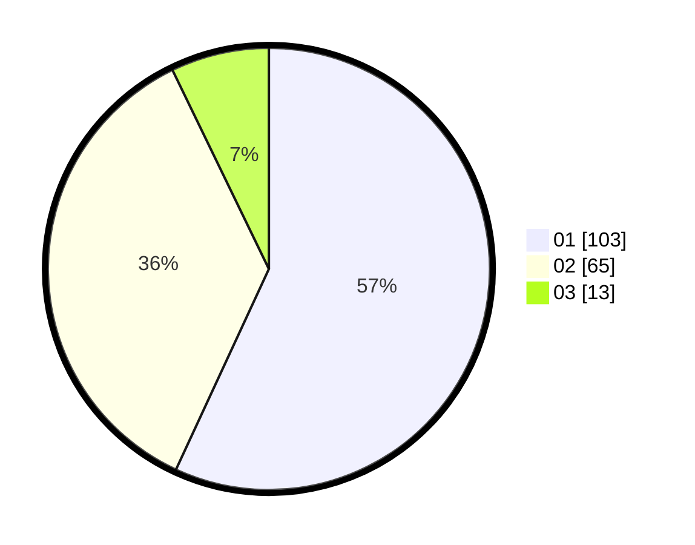

# Hasil

Hasil perolehan suara paslon dapat dilihat pada file paslon-01.txt, paslon-02.txt, dan paslon-03.txt.

Jika tidak ada, artinya data tersebut belum ada pada SIREKAP.

## Perolehan Suara

 * Paslon 01: **103**.
 * Paslon 02: **65**.
 * Paslon 03: **13**.

## Foto C Plano

https://sirekap-obj-formc.kpu.go.id/a3b6/pemilu/ppwp/31/72/03/10/04/3172031004056-20240216-130750--5f3c8ef1-c9f7-4d93-bde5-ba3ce8f3d254.jpg

https://sirekap-obj-formc.kpu.go.id/a3b6/pemilu/ppwp/31/72/03/10/04/3172031004056-20240216-130800--3c8a791c-c744-4ba5-9d0f-0bd2066c7866.jpg

https://sirekap-obj-formc.kpu.go.id/a3b6/pemilu/ppwp/31/72/03/10/04/3172031004056-20240216-130755--497cd12a-5240-4cd1-be07-e1c95ad3b8c3.jpg

## DATA PEMILIH TETAP

Jumlah pemilih dalam DPT: **280**.
 * L: **152**.
 * P: **128**.

## DATA PENGGUNA HAK PILIH

Jumlah pengguna hak pilih dalam DPT: **280**.
 * L: **152**.
 * P: **128**.

Jumlah pengguna hak pilih dalam DPTb: **0**.
 * L: **0**.
 * P: **0**.

Jumlah pengguna hak pilih dalam DPK: **1**.
 * L: **1**.
 * P: **0**.

Jumlah pengguna hak pilih: **281**.
 * L: **153**.
 * P: **128**.

## JUMLAH SUARA SAH DAN TIDAK SAH

JUMLAH SELURUH SUARA SAH: **181**.

JUMLAH SUARA TIDAK SAH: **3**.

JUMLAH SELURUH SUARA SAH DAN SUARA TIDAK SAH: **184**.
