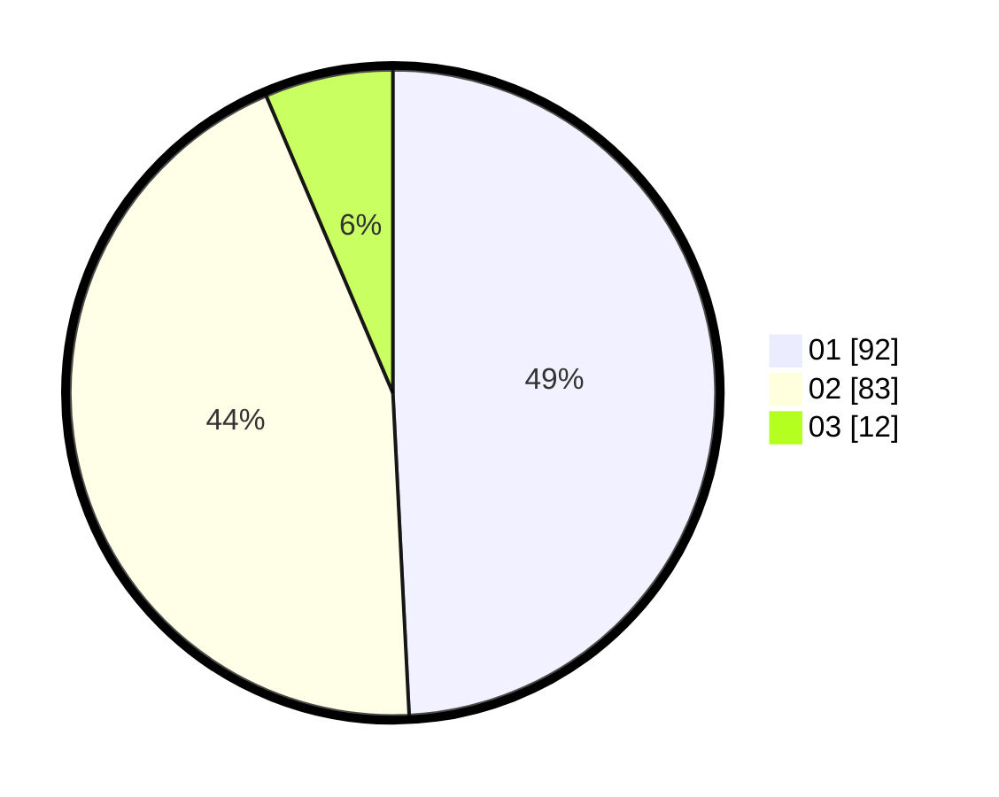

# Hasil

Hasil perolehan suara paslon dapat dilihat pada file paslon-01.txt, paslon-02.txt, dan paslon-03.txt.

Jika tidak ada, artinya data tersebut belum ada pada SIREKAP.

## Perolehan Suara

 * Paslon 01: **92**.
 * Paslon 02: **83**.
 * Paslon 03: **12**.

## Foto C Plano

https://sirekap-obj-formc.kpu.go.id/437e/pemilu/ppwp/31/72/03/10/04/3172031004059-20240216-005556--f719703d-5d8a-43a3-a981-b9d9d0c0d48b.jpg

https://sirekap-obj-formc.kpu.go.id/437e/pemilu/ppwp/31/72/03/10/04/3172031004059-20240216-005557--520f5163-8e4c-475e-a57b-f3ab04ad6272.jpg

https://sirekap-obj-formc.kpu.go.id/437e/pemilu/ppwp/31/72/03/10/04/3172031004059-20240216-005557--540011cf-38af-4b26-bfdd-20c4b1cc61bb.jpg

## DATA PEMILIH TETAP

Jumlah pemilih dalam DPT: **268**.
 * L: **137**.
 * P: **737**.

## DATA PENGGUNA HAK PILIH

Jumlah pengguna hak pilih dalam DPT: **187**.
 * L: **77**.
 * P: **110**.

Jumlah pengguna hak pilih dalam DPTb: **0**.
 * L: **0**.
 * P: **0**.

Jumlah pengguna hak pilih dalam DPK: **1**.
 * L: **1**.
 * P: **0**.

Jumlah pengguna hak pilih: **0**.
 * L: **0**.
 * P: **0**.

## JUMLAH SUARA SAH DAN TIDAK SAH

JUMLAH SELURUH SUARA SAH: **187**.

JUMLAH SUARA TIDAK SAH: **1**.

JUMLAH SELURUH SUARA SAH DAN SUARA TIDAK SAH: **188**.
