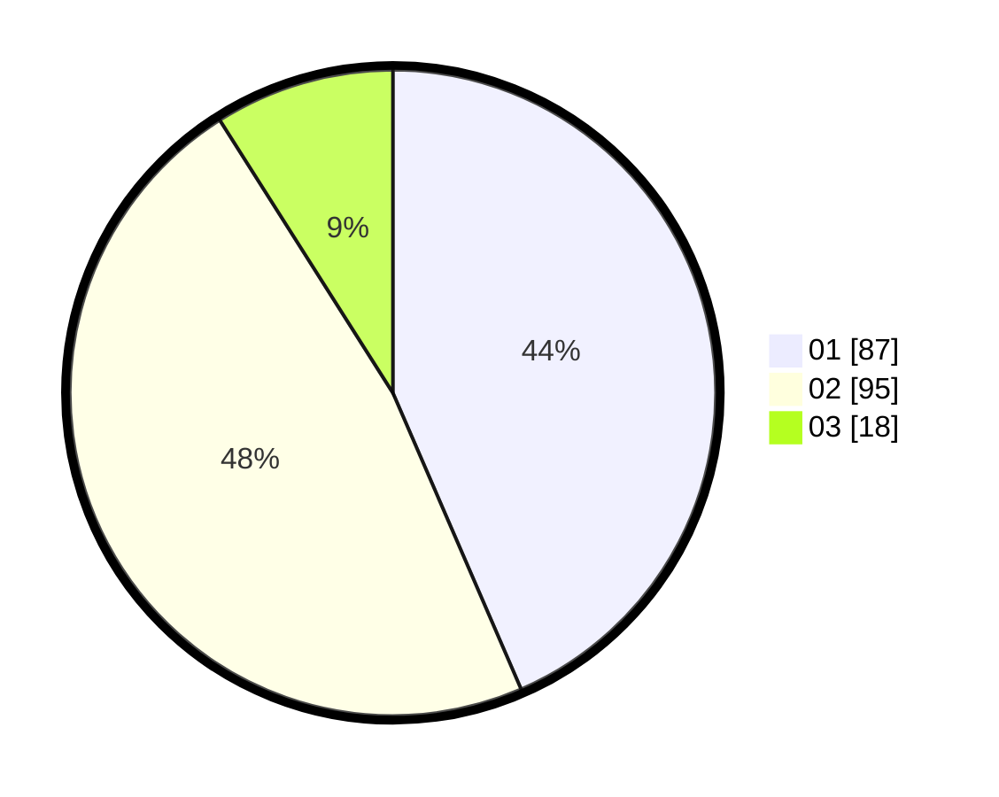

# Hasil

Hasil perolehan suara paslon dapat dilihat pada file paslon-01.txt, paslon-02.txt, dan paslon-03.txt.

Jika tidak ada, artinya data tersebut belum ada pada SIREKAP.

## Perolehan Suara

 * Paslon 01: **87**.
 * Paslon 02: **95**.
 * Paslon 03: **18**.

## Foto C Plano

https://sirekap-obj-formc.kpu.go.id/c4d2/pemilu/ppwp/31/72/03/10/04/3172031004066-20240215-015226--c722e472-30bc-4cff-b4f7-6b536e13d15a.jpg

https://sirekap-obj-formc.kpu.go.id/c4d2/pemilu/ppwp/31/72/03/10/04/3172031004066-20240215-015331--2d80c7bc-0e7c-4eda-9b3f-3b7f094d409a.jpg

https://sirekap-obj-formc.kpu.go.id/c4d2/pemilu/ppwp/31/72/03/10/04/3172031004066-20240215-015612--ef841901-ce02-43aa-a60a-3655227d05d0.jpg
