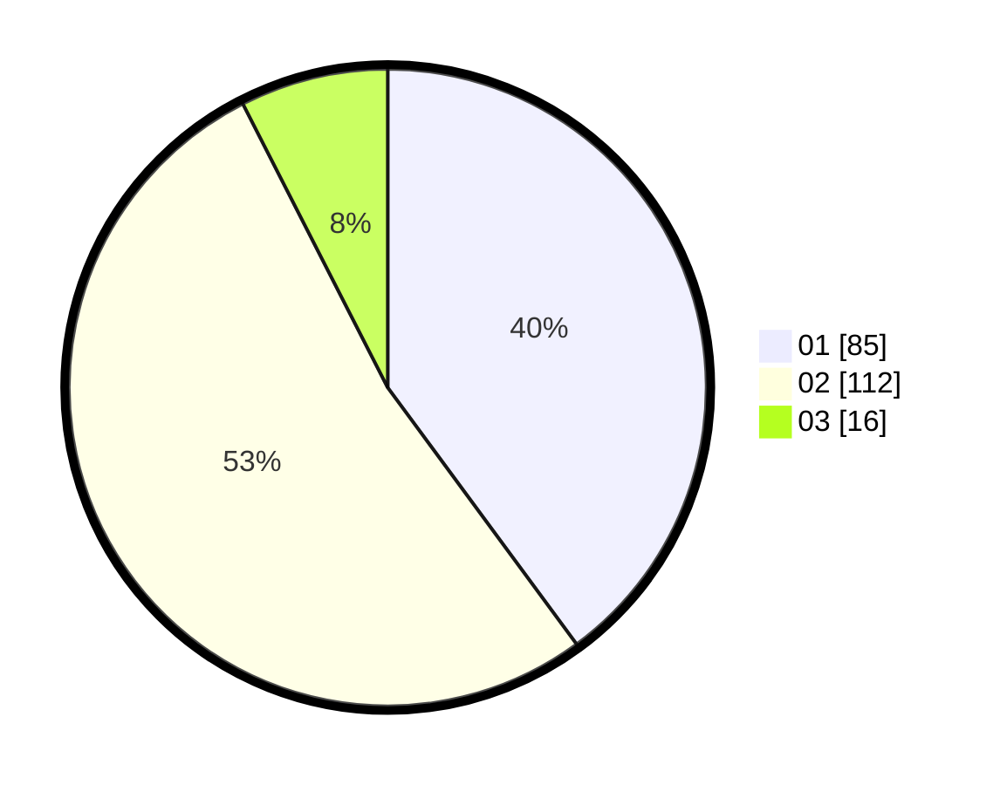

# Hasil

Hasil perolehan suara paslon dapat dilihat pada file paslon-01.txt, paslon-02.txt, dan paslon-03.txt.

Jika tidak ada, artinya data tersebut belum ada pada SIREKAP.

## Perolehan Suara

 * Paslon 01: **85**.
 * Paslon 02: **112**.
 * Paslon 03: **16**.

## Foto C Plano

https://sirekap-obj-formc.kpu.go.id/ebff/pemilu/ppwp/31/72/03/10/04/3172031004070-20240215-014624--f2d83bd0-b8d8-4b01-b356-bc5f687d0bbe.jpg

https://sirekap-obj-formc.kpu.go.id/ebff/pemilu/ppwp/31/72/03/10/04/3172031004070-20240214-220010--7dedd757-17e6-4526-9b78-4f1e14b27296.jpg

https://sirekap-obj-formc.kpu.go.id/ebff/pemilu/ppwp/31/72/03/10/04/3172031004070-20240215-014843--5d7dabab-8625-41e7-94e6-6f9e120cdcd0.jpg
