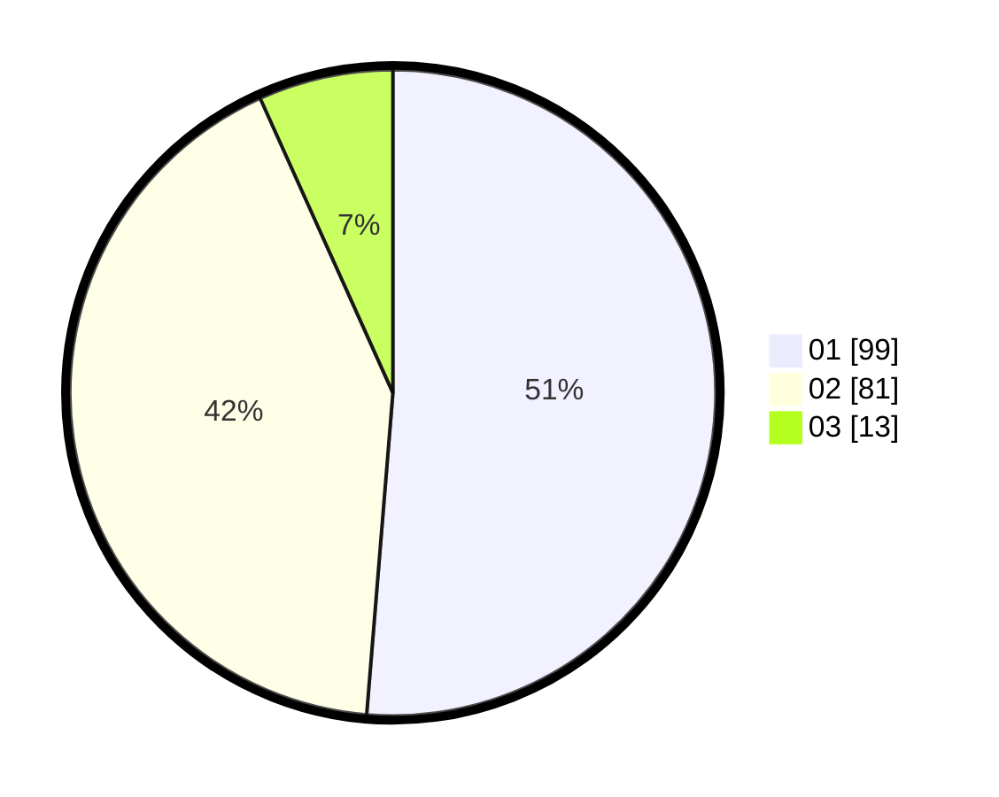

# Hasil

Hasil perolehan suara paslon dapat dilihat pada file paslon-01.txt, paslon-02.txt, dan paslon-03.txt.

Jika tidak ada, artinya data tersebut belum ada pada SIREKAP.

## Perolehan Suara

 * Paslon 01: **99**.
 * Paslon 02: **81**.
 * Paslon 03: **13**.

## Foto C Plano

https://sirekap-obj-formc.kpu.go.id/a950/pemilu/ppwp/31/72/03/10/04/3172031004079-20240214-185319--f8faf006-1c62-46b8-a8b7-9f43f8d0f7ae.jpg

https://sirekap-obj-formc.kpu.go.id/a950/pemilu/ppwp/31/72/03/10/04/3172031004079-20240215-022623--4ed2c8d6-0a45-4928-8bec-ec2f09535d59.jpg

https://sirekap-obj-formc.kpu.go.id/a950/pemilu/ppwp/31/72/03/10/04/3172031004079-20240214-185517--4ad992b8-3b6a-44a3-990e-c621a9ca0281.jpg

## DATA PEMILIH TETAP

Jumlah pemilih dalam DPT: **280**.
 * L: **146**.
 * P: **134**.

## DATA PENGGUNA HAK PILIH

Jumlah pengguna hak pilih dalam DPT: **195**.
 * L: **95**.
 * P: **100**.

Jumlah pengguna hak pilih dalam DPTb: **2**.
 * L: **1**.
 * P: **1**.

Jumlah pengguna hak pilih dalam DPK: **1**.
 * L: **0**.
 * P: **1**.

Jumlah pengguna hak pilih: **198**.
 * L: **96**.
 * P: **102**.

## JUMLAH SUARA SAH DAN TIDAK SAH

JUMLAH SELURUH SUARA SAH: **193**.

JUMLAH SUARA TIDAK SAH: **5**.

JUMLAH SELURUH SUARA SAH DAN SUARA TIDAK SAH: **198**.
