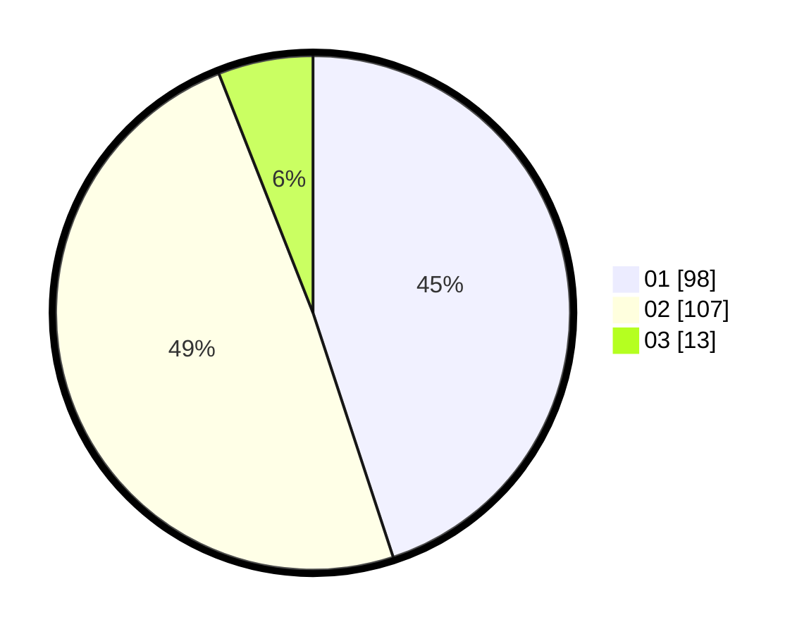

# Hasil

Hasil perolehan suara paslon dapat dilihat pada file paslon-01.txt, paslon-02.txt, dan paslon-03.txt.

Jika tidak ada, artinya data tersebut belum ada pada SIREKAP.

## Perolehan Suara

 * Paslon 01: **98**.
 * Paslon 02: **107**.
 * Paslon 03: **13**.

## Foto C Plano

https://sirekap-obj-formc.kpu.go.id/0b0a/pemilu/ppwp/31/72/03/10/04/3172031004084-20240215-050042--554fa63a-ac0f-40ae-9950-e4a35f805252.jpg

https://sirekap-obj-formc.kpu.go.id/0b0a/pemilu/ppwp/31/72/03/10/04/3172031004084-20240215-050110--6d42eaf2-8340-495d-abff-2f92f7ffd940.jpg

https://sirekap-obj-formc.kpu.go.id/0b0a/pemilu/ppwp/31/72/03/10/04/3172031004084-20240215-050059--7b4d42ef-c065-4389-bfd9-3a2f4e81156e.jpg

## DATA PEMILIH TETAP

Jumlah pemilih dalam DPT: **275**.
 * L: **143**.
 * P: **132**.

## DATA PENGGUNA HAK PILIH

Jumlah pengguna hak pilih dalam DPT: **219**.
 * L: **111**.
 * P: **108**.

Jumlah pengguna hak pilih dalam DPTb: **0**.
 * L: **0**.
 * P: **0**.

Jumlah pengguna hak pilih dalam DPK: **2**.
 * L: **1**.
 * P: **1**.

Jumlah pengguna hak pilih: **221**.
 * L: **112**.
 * P: **109**.

## JUMLAH SUARA SAH DAN TIDAK SAH

JUMLAH SELURUH SUARA SAH: **218**.

JUMLAH SUARA TIDAK SAH: **3**.

JUMLAH SELURUH SUARA SAH DAN SUARA TIDAK SAH: **221**.
